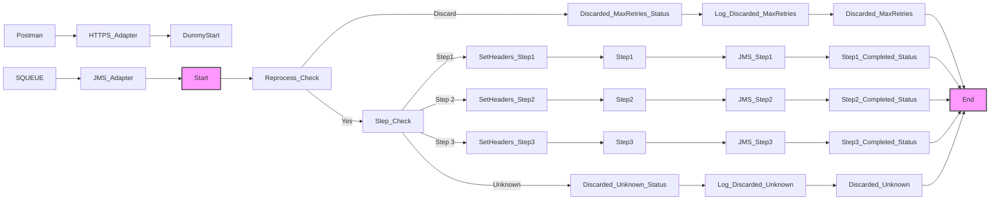

**iFlowId**: SEDA_Model_-_Single_Queue_-_Restart_and_Discard_MMZ - **iFlowVersion**: 1.0.1

**Mermaid Diagram**

**BPMN Diagram**

**Functional Summary**
- **Brief description of the iFlow**
The iFlow implements a SEDA (Staged Event-Driven Architecture) pattern using JMS queues. It receives messages, processes them in a sequence of steps (Step 1, Step 2, Step 3), and handles potential exceptions at each step. It includes retry logic and discards messages exceeding the maximum retry count or having an unknown 'Step' property.

- **Involved systems with Adapters Type and Endpoint Type**
    - SQUEUE (Sender): JMS, EndpointSender
    - Postman (Sender): HTTPS, EndpointSender
    - RQUEUE (Receiver): JMS, EndpointRecevier

- **Key steps**
    1. Receive a message via JMS (from SQUEUE) or HTTPS (from Postman).
    2. Determine the next processing step based on the 'Step' property.
    3. Execute the corresponding step (Step 1, Step 2, or Step 3) by calling a local integration process.
    4. After each step, update the message processing log and send the message to the next step using JMS.
    5. If an exception occurs during any step, log the exception and re-queue the message.
    6. If the message exceeds the maximum retry count, discard the message and log the discarded message.
    7. If the Step property is unknown, discard the message and log the event.

- **Message transformation**
    - The iFlow uses Content Modifier to set headers (SAP_Sender, SAP_Receiver, SAP_MessageType) and properties (Step) at various stages.
    - The Step 1, 2, and 3 processes use Enrichers to prepare the message for subsequent steps.

- **Externalized parameters list, configured values and their descriptions**
    - `MaxRetries`: 10 - Maximum number of retries before discarding a message.
    - `SEDA_MAIN_QUEUE`: SEDA_MODEL_MMZ - The name of the main JMS queue used for message exchange.
    - `Expiration Period`: 7 - Expiration period for JMS messages.
    - `Maximum Retry Interval`: 1440 - Maximum retry interval for JMS messages.
    - `Retention Threshold 4 Alerting`: 1 - Retention threshold for alerting on JMS messages.
    - `Retry Interval`: 15 - Retry interval for JMS messages.
    - `Number of Concurrent Processes`: 1 - Number of concurrent processes allowed for the JMS adapter.

- **DataStore / JMS Dependency**
Yes

- **Cloud Connector Dependency**
Not Found

- **Common Scripts Dependency**
    - Groovy_Logging_Scripts: Log_Discarded_Message.groovy
    - Groovy_Logging_Scripts: Log_Exception_Async.groovy

- **ProcessDirect ComponentType Dependency**
Not Found