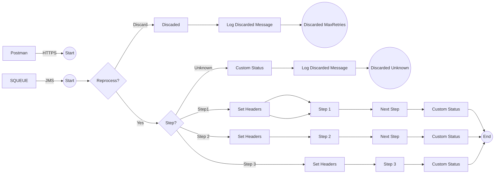

**iFlowId**: SEDA_Model_-_Single_Queue_-_Restart_and_Discard_MMZ - **iFlowVersion**: 1.0.1

**Mermaid Diagram**

**Functional Summary**
- **Brief description of the iFlow**
The iFlow implements a SEDA (Staged Event-Driven Architecture) pattern with a single queue. It receives messages, processes them in multiple steps, and handles exceptions. Messages exceeding the maximum retry count or having an unknown step are discarded.

- **Involved systems with Adapters Type and Endpoint Type**
    - SQUEUE (JMS, EndpointSender)
    - RQUEUE (JMS, EndpointRecevier)
    - Postman (HTTPS, EndpointSender)

- **Key steps**
    1. Receives message via JMS adapter from SQUEUE.
    2. Checks retry count and discards message if it exceeds the maximum retries.
    3. Routes message to Step1, Step2 or Step3 based on the Step property. If Step property is unkown, the message is discarded.
    4. Each Step process calls a local integration process which sets Headers and calls another process.
    5. JMS adapter send the message to RQUEUE after each Step.
    6. If an exception occurs within the Step subprocesses, a custom status is created and an exception is logged asynchronously.
    7. If the message is discarded, a custom status is set, a log is created, and the message is discarded.

- **Message transformation**
    - Enricher is used to set headers and properties for routing and logging.
    - Groovy scripts are used for logging exceptions and discarded messages.
    - Content Modifier to set Header and Body

- **Externalized parameters list, configured values and their descriptions**
    - `MaxRetries`: 10 (Maximum number of retries before discarding a message)
    - `SEDA_MAIN_QUEUE`: SEDA_MODEL_MMZ (The name of the main JMS queue)
    - `Expiration Period`: 7 (Expiration period for messages in days)
    - `Maximum Retry Interval`: 1440 (Maximum interval between retries in minutes)
    - `Retention Threshold 4 Alerting`: 1 (Retention threshold for alerting)
    - `Retry Interval`: 15 (Interval between retries in minutes)
    - `Number of Concurrent Processes`: 1 (Number of concurrent processes for the JMS receiver adapter)

- **DataStore / JMS Dependency**
Yes

- **Cloud Connector Dependency**
Not Found

- **Common Scripts Dependency**
    - Groovy_Logging_Scripts: Log_Discarded_Message.groovy
    - Groovy_Logging_Scripts: Log_Exception_Async.groovy

- **ProcessDirect ComponentType Dependency**
Not Found