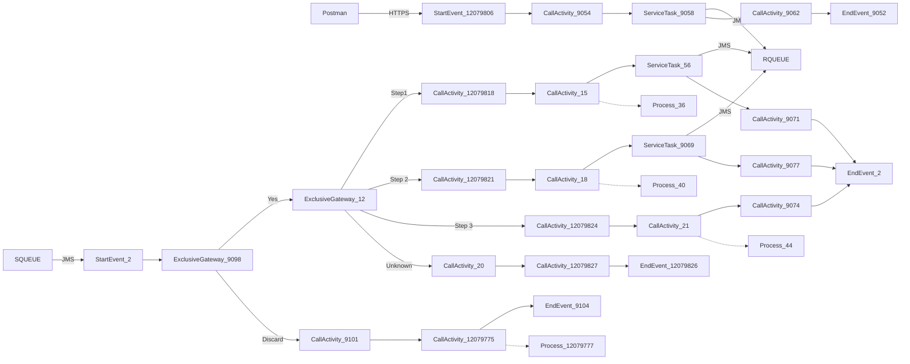

**iFlowId**: SEDA_Model_-_Single_Queue_-_Restart_and_Discard_MMZ - **iFlowVersion**: 1.0.1

**Mermaid Diagram**

**Functional Summary**
- **Brief description of the iFlow**
This iFlow demonstrates a single queue implementation using SEDA (Staged Event-Driven Architecture) with restart and discard message handling. It receives a message, processes it through several steps, and publishes messages to a queue for asynchronous processing. It includes exception handling and message discarding mechanisms based on retry counts.

- **Involved systems with Adapters Type and Endpoint Type**
    - SQUEUE - JMS (EndpointSender)
    - Postman - HTTPS (EndpointSender)
    - RQUEUE - JMS (EndpointRecevier)

- **Key steps**
    1. Receive message via HTTPS from Postman.
    2. Save the initial message and set headers for step 1.
    3. Route the message through steps 1, 2, and 3.
    4. Each step prepares the message and then sends it to the JMS queue for processing.
    5. The SEDA router receives messages from the JMS queue.
    6. The router determines the next step based on the `Step` property and routes accordingly.
    7. If the message fails processing multiple times, it is discarded.
    8. Log async exceptions that occur during processing.

- **Message transformation**
    - The iFlow uses Enrichers to set headers and properties at various stages.
    - Each "Prepare Step" call activity enriches the message content.
    - Custom Status call activities create SAP_MessageProcessingLogCustomStatus for auditing

- **Externalized parameters list, configured values and their descriptions**
    - `MaxRetries`: 10 - Maximum number of retries before discarding a message.
    - `SEDA_MAIN_QUEUE`: SEDA_MODEL_MMZ - The name of the main JMS queue used for asynchronous processing.
    - `Expiration Period`: 7 - Message Expiration period in days
    - `Maximum Retry Interval`: 1440 - Maximum retry interval in minutes
    - `Retention Threshold 4 Alerting`: 1 - Retention Threshold for Alerting (likely in days)
    - `Retry Interval`: 15 - Interval in minutes between message retries.
    - `Number of Concurrent Processes`: 1 - Number of concurrent processes for JMS receiver adapter

- **DataStore / JMS Dependency**
Yes

- **Cloud Connector Dependency**
Not Found

- **Common Scripts Dependency**
    - Log_Discarded_Message.groovy - scriptBundleId: Groovy_Logging_Scripts
    - Log_Exception_Async.groovy - scriptBundleId: Groovy_Logging_Scripts

- **ProcessDirect ComponentType Dependency**
Not Found