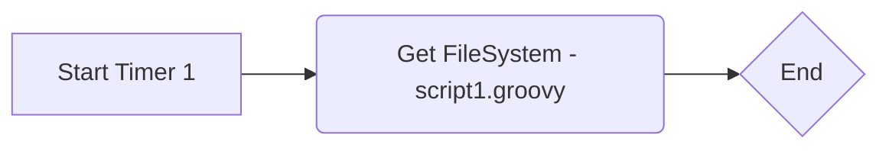

**iFlowId**: Hack_-_Get_Classloader - **iFlowVersion**: 1.0.1

**Mermaid Diagram**

**Functional Summary**
- **Brief description of the iFlow**
This iFlow is triggered by a timer event. After the timer is triggered, it executes a Groovy script named "script1.groovy" and then ends the process.

- **Involved systems with Adapters Type and Endpoint Type**
    -  Timer (Adapter Type: N/A, Endpoint Type: N/A)
    -  Groovy Script (Adapter Type: N/A, Endpoint Type: N/A)

- **Key steps**
 1. Start: The iFlow is initiated by a timer event "Start Timer 1".
 2. Script Execution: The iFlow executes a Groovy script named "script1.groovy" within a Call Activity named "Get FileSystem".
 3. End: The iFlow ends after the script execution.

- **Message transformation**
No message transformation steps are explicitly defined in the iFlow configuration. The Groovy script might perform some transformations but it is not externally visible.

- **Externalized parameters list and their descriptions**
No externalized parameters are defined in the iFlow configuration.

- **DataStore / JMS Dependency**
Not Found

- **Cloud Connector Dependency**
Not Found

- **Common Scripts Dependency**
script1.groovy

- **ProcessDirect ComponentType Dependency**
Not Found