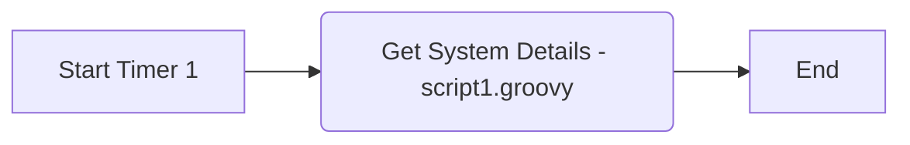

**iFlowId**: Hack__-_Get_Runtime_Details - **iFlowVersion**: 1.0.1

**Mermaid Diagram**

**Functional Summary**
- **Brief description of the iFlow**
This iFlow is scheduled to run based on a timer. When the timer triggers, a Groovy script ("script1.groovy") is executed, and then the iFlow ends.

- **Involved systems with Adapters Type and Endpoint Type**
    -  No external system is involved in the iFlow. The iFlow only uses a timer and a Groovy script.

- **Key steps**
 1. Start Timer event triggers the iFlow execution.
 2. Groovy script "script1.groovy" is executed.
 3. The iFlow ends.

- **Message transformation**
    - None. No message transformations are explicitly defined in the provided XML.

- **Externalized parameters list and their descriptions**
    -  No externalized parameters are defined in the provided XML.

- **DataStore / JMS Dependency**
    - Not Found

- **Cloud Connector Dependency**
    - Not Found

- **Common Scripts Dependency**
    - List of scripts: script1.groovy

- **ProcessDirect ComponentType Dependency**
    - Not Found