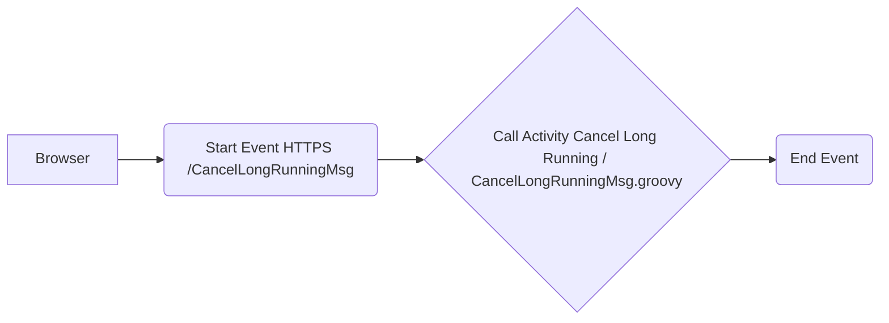

**iFlowId**: Iflow_-_Util_-_Cancel_Long_Running - **iFlowVersion**: 1.0.0

**Mermaid Diagram**

**Functional Summary**
- **Brief description of the iFlow**
The iFlow is designed to cancel long-running messages. It receives an HTTPS request and executes a Groovy script to perform the cancellation.

- **Involved systems with Adapters Type and Endpoint Type**
    - Browser (HTTPS Sender Adapter, EndpointSender)

- **Key steps**
    1. Receive HTTPS request at `/CancelLongRunningMsg`.
    2. Execute the "CancelLongRunningMsg.groovy" script.
    3. End the iFlow.

- **Message transformation**
    - The core logic is implemented in the "CancelLongRunningMsg.groovy" script, which likely manipulates the message content or headers to trigger the cancellation process.  Details of this transformation are within the script itself.

- **Externalized parameters list and their descriptions**
   No externalized parameters are explicitly defined in the provided XML. The Groovy script "CancelLongRunningMsg.groovy" might contain parameters, but their definitions aren't present in the XML.

- **DataStore / JMS Dependency**
Not Found

- **Cloud Connector Dependency**
Not Found

- **Common Scripts Dependency**
Common_-_Groovy_Troubleshooting

- **ProcessDirect ComponentType Dependency**
Not Found