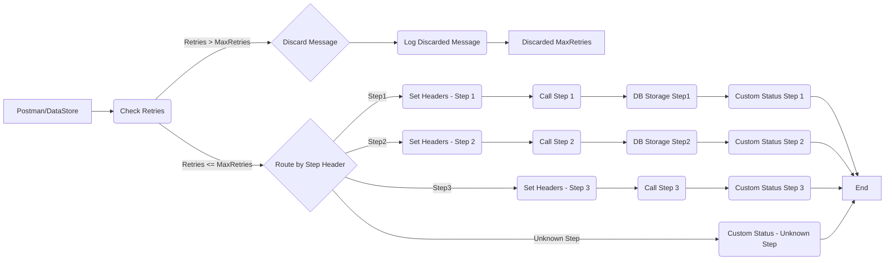

**iFlowId**: SEDA_Model_-_Single_DS_-_Restart_and_Discard - **iFlowVersion**: 1.0.0

**Functional Summary**

- **Brief description of the iFlow**
The iFlow processes messages retrieved from a Data Store, executes three sequential steps (Step 1, Step 2, and Step 3), and then completes. It incorporates retry logic based on the `SAP_DataStoreRetries` header. If the maximum number of retries (`MaxRetries`) is exceeded, the message is discarded. Each step involves updating headers and potentially triggering exceptions. The iFlow also includes exception handling subprocesses to log asynchronous exceptions.

- **Involved systems**
    - Postman (via HTTPS)
    - Data Store (DS)

- **Used Adapters**
    - HTTPS (Sender)
    - DataStoreConsumer (Sender)

- **Key steps**
    1. Receive message via HTTPS or DataStore.
    2. Check retry count. If retry count > MaxRetries, discard message.
    3. Based on the "Step" header value, route the message to either step 1, step 2, step 3 or route to exception flow if "Step" header value is not valid.
    4. Execute Step 1: Enrich message, set Step header to Step2 and save data to datastore.
    5. Execute Step 2: Enrich message, set Step header to Step3 and save data to datastore.
    6. Execute Step 3: Enrich message, set sender, receiver, message type headers.
    7. End the iFlow.

- **Message transformation**
    - Header enrichment to set routing information (`SAP_Sender`, `SAP_Receiver`, `SAP_MessageType`, `Step`).
    - Custom status updates to the message processing log (`SAP_MessageProcessingLogCustomStatus`).
    - Content enrichment with constant values and expressions.

- **Externalized parameters list and their descriptions**
    - `RoleName`: Role required for accessing the HTTPS endpoint.
    - `Maximum Retry Interval`: Maximum interval between retries for DataStore Consumer.
    - `Exponential Backoff`: Flag indicating whether to use exponential backoff for retries.
    - `Data Store Name`: Name of the data store used for persistence.
    - `Poll Interval`: Interval at which the DataStore Consumer polls for new messages.
    - `Retry Interval`: Interval between retries for the DataStore Consumer.
    - `Lock Timeout`: Timeout for file locking in the DataStore Consumer.
    - `Retention Threshold 4 Alerting`: Retention threshold for alerting purposes, specific to DB Storage.
    - `Expiration Period`: Expiration period for data in DB storage.
    - `MaxRetries`: Maximum number of retries before discarding the message.

- **DataStore / JMS Dependency**
Yes

**Mermaid Diagram**

