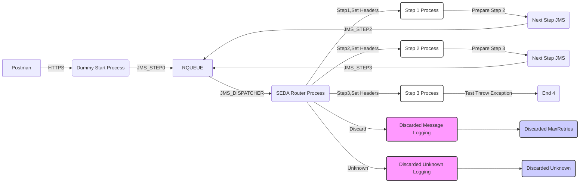

**iFlowId**: SEDA_Model_-_Single_Queue_-_Restart_and_Discard - **iFlowVersion**: 1.0.0

**Functional Summary**

- **Brief description of the iFlow**
This iFlow implements a SEDA (Staged Event-Driven Architecture) pattern with a single JMS queue for message processing. The flow simulates multiple processing steps (Step 1, Step 2, and Step 3) and handles exceptions by logging them. It includes retry mechanism and a discard option if the message exceeds the maximum retry limit. The iFlow starts with an HTTP endpoint that puts messages on the main JMS queue, for asynchronous processing.

- **Involved systems**
    - SQUEUE (Sender Queue): Sends initial message to the main queue
    - RQUEUE (Receiver Queue): Receives messages from the main queue.
    - Postman: An external system that triggers the iFlow via HTTPS.

- **Used Adapters**
    - JMS (Java Message Service): Used for asynchronous message queuing between steps.
    - HTTPS: Used to expose an endpoint to start the iFlow.

- **Key steps**
    1. Receives message from HTTPS endpoint ("/seda/start/jms").
    2. Sets initial headers and saves the message to JMS Queue.
    3. SEDA Router process picks up the message from the JMS queue, determines processing step.
    4. Executes Step 1, Step 2, or Step 3 based on the "Step" property. Each step sets headers, prepares and executes the next step using JMS.
    5. If max retries are exceeded, the message is discarded, and logged.
    6. Exceptions are caught and logged asynchronously.

- **Message transformation**
    - The iFlow uses enrichers and header manipulation to prepare messages for subsequent steps. Specifically, it creates, deletes, and modifies message headers (e.g., `SAP_Sender`, `SAP_Receiver`, `SAP_MessageType`). Also message properties are being manipulated (like `Step`).
    - Steps prepare message to be consumed by the next step.

- **Externalized parameters list and their descriptions**
    - `{{SEDA_MAIN_QUEUE}}`: The name of the main JMS queue used for message exchange between steps.
    - `{{Number of Concurrent Processes}}`:  The number of concurrent processes for JMS receiver adapter.
    - `{{Maximum Retry Interval}}`: The maximum retry interval for JMS receiver adapter.
    - `{{Retry Interval}}`: The retry interval for JMS receiver adapter.
    - `{{Retention Threshold 4 Alerting}}`: Retention threshold for alerting, used in JMS adapter.
    - `{{Expiration Period}}`: Expiration period for JMS messages.
    - `{{MaxRetries}}`: Maximum number of retries before discarding a message.

- **DataStore / JMS Dependency**
Yes

**Mermaid Diagram**

- **Visual representation of the flow**

