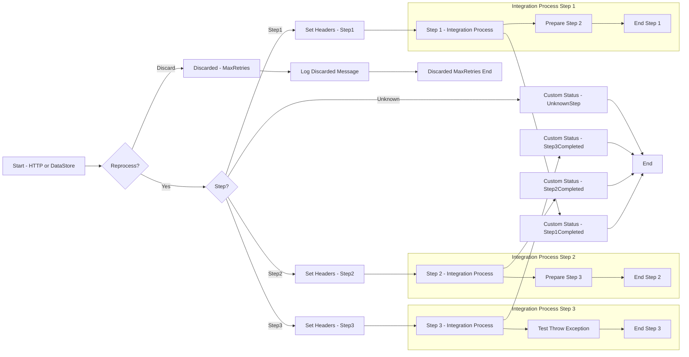

**iFlowId**: SEDA_Model_-_Single_DS_-_Restart_and_Discard - **iFlowVersion**: 1.0.0

**Functional Summary**

- **Brief description of the iFlow**
This iFlow demonstrates a SEDA (Staged Event-Driven Architecture) pattern with a single Data Store for persistence, including mechanisms for restarting and discarding messages. The flow retrieves messages from a Data Store, processes them through a series of steps (Step 1, Step 2, Step 3), and handles potential exceptions at each step. It also includes logic to discard messages that exceed a defined retry limit. It can be triggered by HTTP request or DataStore.

- **Involved systems**
    - Postman
    - DS (Data Store)

- **Used Adapters**
    - HTTPS
    - DataStoreConsumer

- **Key steps**
    i. The iFlow starts either by receiving an HTTP message from Postman or consuming a message from a DataStore.
    ii. The SEDA Router determines the next step based on the "Step" header of the message.
    iii. The message is processed by one of three steps: Step 1, Step 2, or Step 3. Each step sets the "Step" header for the subsequent step.
    iv. Each processing step (Step 1, Step 2, Step 3) calls a local integration process which enriches with custom header to indicate start of execution and then proceeds to prepare for the next step by setting headers and body accordingly. Exception sub-processes are implemented to capture failure and log custom status.
    v. If the message fails and exceeds the maximum retry attempts (MaxRetries), it is discarded. Otherwise it remains in the datastore to be picked up for reprocessing.

- **Message transformation**
    - Each "Step" integration process prepares a message (sets header *Step* to the next step to be executed, i.e. *Step2Message*).
    - The "Set Headers" enrichers create headers such as `SAP_Sender`, `SAP_Receiver`, `SAP_MessageType`, and `Step` with constant values.
    - The "Custom Status" enrichers create `SAP_MessageProcessingLogCustomStatus` headers using expressions that combine the `SAP_MessageType` header with a status message.

- **Externalized parameters list and their descriptions**
    - `RoleName`: Role required to trigger the iFlow via HTTP.
    - `Maximum Retry Interval`: Maximum time interval between retry attempts for DataStore consumption.
    - `Exponential Backoff`: Flag to enable exponential backoff for DataStore retries.
    - `Data Store Name`: Name of the Data Store used for persistence.
    - `Poll Interval`: Interval at which the DataStore is polled for new messages.
    - `Retry Interval`: Initial interval between retry attempts for DataStore consumption.
    - `Lock Timeout`: Timeout for file lock mechanism.
    - `Retention Threshold 4 Alerting`: Retention threshold for alerting.
    - `Expiration Period`: Expiration period for messages in the Data Store.
    - `MaxRetries`: Maximum number of retries before a message is discarded.

- **DataStore / JMS Dependency**
    Yes

**Mermaid Diagram**

