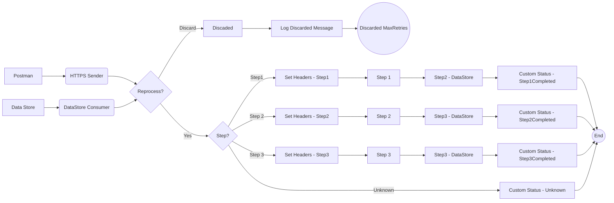

**iFlowId**: SEDA_Model_-_Single_DS_-_Restart_and_Discard - **iFlowVersion**: 1.0.0

**Mermaid Diagram**

**Functional Summary**
- **Brief description of the iFlow**
The iFlow processes messages retrieved from a Data Store, routes them through a series of steps (Step 1, Step 2, Step 3), and updates a Data Store with the processing status. It includes exception handling and logic to discard messages if they exceed the maximum number of retries. An HTTPS endpoint is available to trigger the iFlow.

- **Involved systems**
    - Postman
    - DS (Data Store)

- **Used Adapters**
    - HTTPS
    - DataStoreConsumer

- **Key steps**

    1.  Receive messages from HTTPS endpoint (Postman) or Data Store
    2.  Check number of retries for a message. If max number of retries is reached, message is discarded.
    3.  Route the message to Step 1, Step 2, or Step 3 based on the 'Step' header.
    4.  Each step saves the message to the Data Store with updated headers and status.
    5.  If an exception occurs during processing, log the exception details, and restart the process.

- **Message transformation**
    - Set Headers enricher to add or modify message headers (e.g., SAP_Sender, SAP_Receiver, SAP_MessageType, Step).
    - Custom Status enricher to set the SAP_MessageProcessingLogCustomStatus.
    - Groovy scripts for logging discarded messages and exception details.

- **Externalized parameters list and their descriptions**
    - RoleName: Role required to access the HTTPS endpoint.
    - Maximum Retry Interval: Maximum time interval for retrying DataStore Consumer.
    - Exponential Backoff: Flag to enable exponential backoff for DataStore Consumer retries.
    - Data Store Name: Name of the Data Store used for message persistence.
    - Poll Interval: Time interval for polling Data Store Consumer.
    - Retry Interval: Time interval for retrying Data Store Consumer.
    - Lock Timeout: Timeout duration for file lock.
    - Retention Threshold 4 Alerting: Threshold for alerting when data retention is exceeded.
    - Expiration Period: Time period after which data expires in the data store.
    - MaxRetries: Maximum number of retries before discarding a message.

- **DataStore / JMS Dependency**
Yes

- **Cloud Connector Dependency**
Not Found