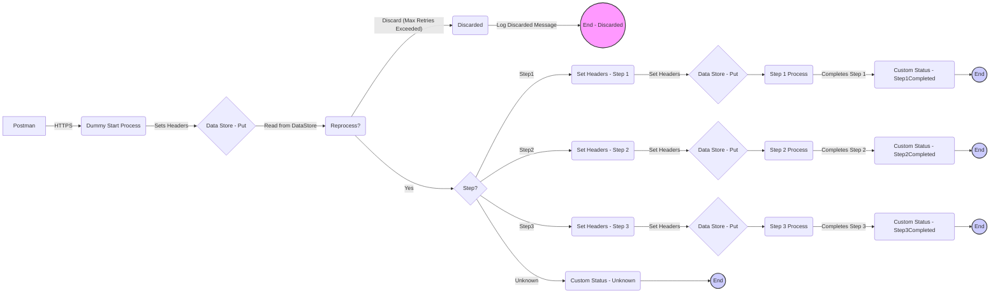

**iFlowId**: SEDA_Model_-_Single_DS_-_Restart_and_Discard - **iFlowVersion**: 1.0.0

**Functional Summary**

-   **Brief description of the iFlow**
    This iFlow simulates a scenario where messages are processed asynchronously through multiple steps, leveraging a Data Store for persistence and retries. It demonstrates error handling, logging, and message discarding based on a maximum retry count.

-   **Involved systems**
    -   Postman
    -   DataStore (DS)

-   **Used Adapters**
    -   HTTPS
    -   DataStore Consumer

-   **Key steps**
    i.  Receive message via HTTPS from Postman.
    ii. Store the message in a Data Store.
    iii. Read message from Data Store and route to step 1,2 or 3 based on header *Step*.
    iv. Each step prepares for the next one by adding the necessary headers and body. Steps 1,2 and 3 are DB storage (Datastore Put)
    v.  If reprocessing is required (initial load or failure) the message is put again into DataStore for retries.
    vi. After max retries are exeeded, the message is discarded.

-   **Message transformation**
    -   Content Enrichers are used to set headers (like `Step`, `SAP_Sender`, `SAP_Receiver`, `SAP_MessageType`) at the start and between the "steps"
    -   Prepare Steps enrichers transform the body
    -   Groovy scripts are used for logging and exception handling.

-   **Externalized parameters list and their descriptions**
    -   `RoleName`:  Role required to access the iFlow via HTTPS.
    -   `Maximum Retry Interval`: Maximum interval between retry attempts for DataStore Consumer.
    -   `Exponential Backoff`: Flag to enable exponential backoff for retry attempts in DataStore Consumer.
    -   `Data Store Name`: Name of the Data Store used for persistence.
    -   `Poll Interval`: Interval for polling the Data Store for new messages.
    -   `Retry Interval`: Initial interval between retry attempts for DataStore Consumer.
    -   `Lock Timeout`: Timeout for acquiring a lock on the Data Store entry.
    -   `Retention Threshold 4 Alerting`: Threshold for triggering alerts based on data retention.
    -   `Expiration Period`: Period after which data in the Data Store expires.
    -   `MaxRetries`: Maximum number of retries before discarding the message.

-   **DataStore / JMS Dependency**
    Yes

**Mermaid Diagram**

