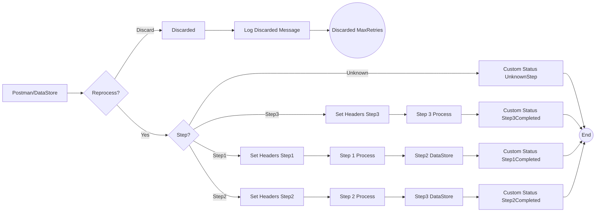

**iFlowId**: SEDA_Model_-_Single_DS_-_Restart_and_Discard - **iFlowVersion**: 1.0.0

**Functional Summary**

- **Brief description of the iFlow**
This iFlow demonstrates a SEDA (Staged Event-Driven Architecture) pattern with data persistence in a Data Store. It receives messages either via HTTPS or from the Data Store, processes them through a series of steps (Step 1, Step 2, Step 3), and handles exceptions by logging them asynchronously. The iFlow includes retry and discard logic based on a maximum retry count.

- **Involved systems**
    - Postman
    - DataStore

- **Used Adapters**
    - HTTPS
    - DataStoreConsumer

- **Key steps**
    1. Receive message via HTTPS or DataStore.
    2. Determine if message re-processing is needed. Discard message if max retries has been reached.
    3. Route the message based on the "Step" header (Step1, Step2, Step3, or Unknown).
    4. Execute Step 1, Step 2, or Step 3 local integration processes, which each prepare data and execute logic. Steps 1 to 3 persist the message to a Data Store.
    5. Log Exceptions asynchronously.
    6. Complete processing.

- **Message transformation**
    - The iFlow enriches messages with headers like `SAP_Sender`, `SAP_Receiver`, `SAP_MessageType`, and `Step` using Enricher flow steps.
    - Custom message processing log statuses are set at various stages to track progress.
    - The "Prepare Step" call activities add a 'Step' header and wrap content in an envelope.
    - Groovy scripts are utilized for logging messages and exceptions.

- **Externalized parameters list and their descriptions**
    - `RoleName`: Role required for accessing the HTTPS endpoint.
    - `Maximum Retry Interval`: The maximum retry interval of the DataStore Consumer
    - `Exponential Backoff`:  Whether the DataStore consumer uses an Exponential Backoff strategy
    - `Data Store Name`: The name of the Data Store used for persistence.
    - `Poll Interval`: The interval at which the DataStore is polled.
    - `Retry Interval`: The interval between retry attempts for the DataStore.
    - `Lock Timeout`: Timeout for file locking
    - `Retention Threshold 4 Alerting`: Retention threshold of stored messages before alerting.
    - `Expiration Period`: Expiration period of stored messages.
    - `MaxRetries`: The maximum number of retries before discarding a message.

- **DataStore / JMS Dependency**
Yes

**Mermaid Diagram**

