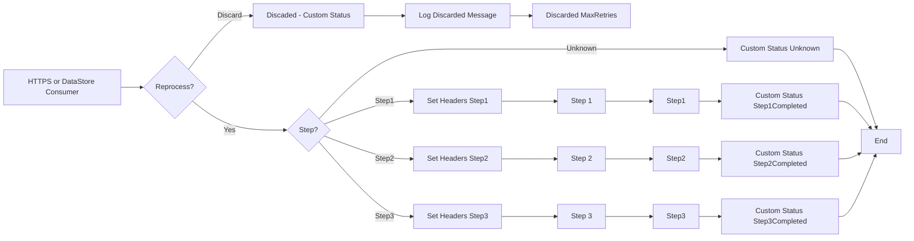

**iFlowId**: SEDA_Model_-_Single_DS_-_Restart_and_Discard - **iFlowVersion**: 1.0.0

- **Brief description of the iFlow**

This iFlow demonstrates a SEDA (Staged Event-Driven Architecture) model that processes messages in a series of steps (Step 1, Step 2, Step 3). It uses a Data Store Consumer to receive messages and includes error handling with logging of exceptions.  It also incorporates retry logic and discards messages that exceed the maximum retry attempts. The flow starts by receiving a message either via HTTPS from Postman or from a DataStore. It then executes a series of steps, potentially persisting data to a Data Store at each step.

- **Involved systems**

    - Postman
    - DS (Data Store)

- **Used Adapters**

    - HTTPS
    - DataStoreConsumer

- **Key steps**

    1.  Receive message via HTTPS or DataStore.
    2.  Determine if the message needs to be reprocessed based on `SAP_DataStoreRetries` header.
    3.  Route the message to different steps based on the `Step` header.
    4.  For each step (Step1, Step2, Step3):
        -   Set appropriate headers (sender, receiver, message type).
        -   Persist the message to the Data Store.
        -   Set a custom status in the message processing log.
        -   Call external sub-processes
    5.  Handle exceptions and log them asynchronously.
    6.  If the maximum retry attempts are exceeded, discard the message and log it.

- **Message transformation**

    -   Enrichers are used in each step to create and set headers such as `SAP_Sender`, `SAP_Receiver`, `SAP_MessageType`, and `Step`.
    -   Enrichers are used to set custom statuses in the message processing log, such as `Step1Completed`, `Step2Completed`, and `Step3Completed`.
    -   The "Prepare Step" activities (e.g., "Prepare Step 2") add headers and potentially wrap the message content in an envelope with base64 encoded content.

- **Externalized parameters list and their descriptions**

    -   `RoleName`:  Used for role-based authentication in the HTTPS sender adapter.
    -   `Maximum Retry Interval`: Maximum retry interval for the DataStoreConsumer adapter.
    -   `Exponential Backoff`: Exponential backoff setting for the DataStoreConsumer adapter.
    -   `Data Store Name`:  Name of the Data Store used for persistence.
    -   `Poll Interval`: Poll interval for the DataStoreConsumer adapter.
    -   `Retry Interval`: Retry interval for the DataStoreConsumer adapter.
    -   `Lock Timeout`: Lock timeout for the DataStoreConsumer adapter.
    -   `Retention Threshold 4 Alerting`: Retention threshold for alerting related to the data store.
    -   `Expiration Period`: Expiration period for data stored in the data store.
    -   `MaxRetries`: Maximum number of retries before discarding a message.

- **DataStore / JMS Dependency**

Yes