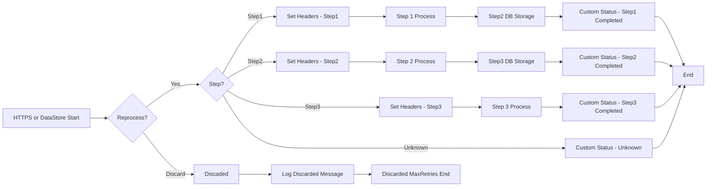

**iFlowId**: SEDA_Model_-_Single_DS_-_Restart_and_Discard - **iFlowVersion**: 1.0.0

**Mermaid Diagram**

**Functional Summary**
- **Brief description of the iFlow**
This iFlow simulates an asynchronous message processing scenario, where messages are picked up from a Data Store, processed through a series of steps, and then stored back in the Data Store. It incorporates exception handling, logging, and a mechanism to discard messages after a certain number of retries. The process is triggered by either an HTTPS call or the Data Store Consumer.

- **Involved systems with Adapters Type and Endpoint Type**
    - Postman: HTTPS (Sender)
    - DS: DataStoreConsumer (Sender) using JDBC endpoint

- **Key steps**
    1. Start: The iFlow starts either via an HTTPS request from Postman or consuming a message from a Data Store.
    2. Set Headers (Dummy Start): Sets initial headers such as SAP_Sender, SAP_Receiver, SAP_MessageType, and Step.
    3. Step1 DB Storage: Stores the message in the Data Store with headers using operation "put".
    4. SEDA Router: Routes the message to different steps (Step1, Step2, Step3) based on the 'Step' header value.
    5. Step 1, Step 2, Step 3: Each step prepares the message, enriches it with headers, and calls a sub-process. They also handle exceptions and log them. Step 3 includes logic to throw an exception for testing.
    6. Discard Message: If the message fails after the maximum number of retries, it is discarded and logged.

- **Message transformation**
    - The iFlow uses Enricher components to add custom statuses and headers to the message.
    - Groovy scripts are employed for logging exceptions and discarding messages.
    - Prepare Step 2 and Prepare Step 3 activities wrap messages in an Envelope structure.

- **Externalized parameters list and their descriptions**
    - RoleName: Used for Role Based Authentication for HTTPS sender.
    - Maximum Retry Interval: Maximum interval for retrying DataStore consumer.
    - Exponential Backoff: Boolean ({{Exponential Backoff}}) to configure DataStore consumer.
    - Data Store Name: Name of the Data Store used for message persistence.
    - Poll Interval: Interval for polling new data from the Data Store.
    - Retry Interval: Interval for retrying DataStore consumer.
    - Lock Timeout: Timeout for file lock in DataStore consumer.
    - Retention Threshold 4 Alerting: Threshold to alert message retention in DB storage.
    - Expiration Period: Period which message remains in DB Storage.
    - MaxRetries: Maximum number of retries before discarding a message.

- **DataStore / JMS Dependency**
Yes

- **Cloud Connector Dependency**
Not Found

- **Common Scripts Dependency**
List of scripts: Log_Discarded_Message.groovy, Log_Exception_Async.groovy, script1.groovy

- **ProcessDirect ComponentType Dependency**
Not Found