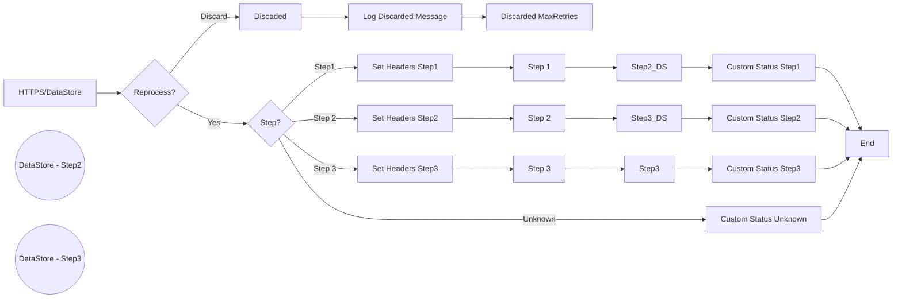

**iFlowId**: SEDA_Model_-_Single_DS_-_Restart_and_Discard - **iFlowVersion**: 1.0.0

**Mermaid Diagram**
- **Visual representation of the flow**

**Functional Summary**
- **Brief description of the iFlow**
This iFlow processes messages retrieved from a DataStore, routes them through a series of steps, and handles exceptions. It includes retry logic and discards messages that exceed the maximum retry attempts. It uses SEDA router for process the message in different steps.

- **Involved systems**
    - DS (DataStore)
    - Postman

- **Used Adapters**
    - HTTPS
    - DataStore Consumer

- **Key steps**
    1. Receive message from HTTPS endpoint or DataStore.
    2. Check if the message needs to be reprocessed based on headers. If reprocess is required route to next steps, otherwise Discarded message.
    3. Route messages to "Step1", "Step2", "Step3" based on the `Step` header using a exclusive gateway. If `Step` header doesn't match any predefined value, route to `UnknownStep`
    4. Set header and then save the message to dataStore per step.
    5. Enrich Message Processing Log with custom status.

- **Message transformation**
    - Setting headers `SAP_Sender`, `SAP_Receiver`, `SAP_MessageType` and `Step` for routing.
    - Setting custom status messages using expressions like `${header.SAP_MessageType} - Step1Completed`.
    - Adding/Creating MessageProcessingLogCustomStatus:
        - "Step1Exception",
        - "Step2Exception",
        - "Step3Exception",
        - "RouterException",
        - "DiscardedMaxRetries",
        - "UnknownStep"

- **Externalized parameters list and their descriptions**
    - RoleName: User Role for HTTPS sender authentication.
    - Maximum Retry Interval: Maximum interval for DataStore retry.
    - Exponential Backoff: Flag to enable exponential backoff for DataStore retry.
    - Data Store Name: Name of the DataStore.
    - Poll Interval: Interval for polling DataStore.
    - Retry Interval: Interval for retrying DataStore.
    - Lock Timeout: Lock timeout for DataStore.
    - Retention Threshold 4 Alerting: Retention Threshold for DataStore alerting.
    - Expiration Period: Expiration period for DataStore.
    - MaxRetries: Max Retries number.

- **DataStore / JMS Dependency**
Yes

- **Cloud Connector Dependency**
Not Found

- **Common Scripts Dependency**
Yes