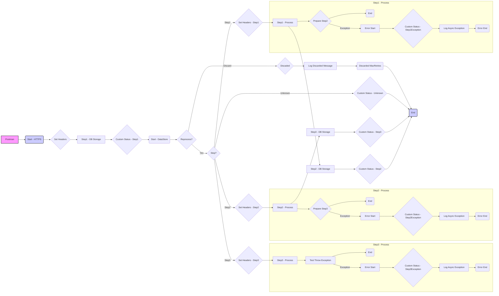

**iFlowId**: SEDA_Model_-_Single_DS_-_Restart_and_Discard - **iFlowVersion**: 1.0.0

- **Brief description of the iFlow**
The iFlow processes messages retrieved from a Data Store, potentially retrying failed steps. It has three main processing steps and handles exceptions by logging them. It also includes logic to discard messages that exceed the maximum retry attempts. A dummy start process provides an entry point via HTTPS for starting asynchronous processing.

- **Involved systems**
    - Postman
    - DS (Data Store)

- **Used Adapters**
    - HTTPS
    - DataStoreConsumer

- **Key steps**
    1.  Receive an HTTPS request (Dummy Start)
    2.  Store message to the datastore
    3.  Retrieve messages from the data store through SEDA Router
    4.  Execute Step 1, Step 2 and Step 3 (Local Integration Processes)
    5.  Log Async Exception (if any step fails)
    6.  Discard message (if max retries are exceeded)

- **Message transformation**
    - Set Headers (multiple enrichers to set sender, receiver, message type, and step)
    - Custom Status (multiple enrichers to set custom status in the message processing log based on message type and completed step)
    - Prepare Step (enricher to prepare the message for each processing step)
    - Groovy Scripts (for logging discarded messages and async exceptions)

- **Externalized parameters list and their descriptions**
    - RoleName: User role required to access the HTTPS endpoint.
    - Data Store Name: Name of the Data Store used for storing and retrieving messages.
    - Maximum Retry Interval: The maximum retry interval.
    - Exponential Backoff: Whether exponential backoff is enabled.
    - Poll Interval: Interval at which the Data Store is polled for new messages.
    - Retry Interval: Interval between retry attempts for failed operations.
    - Lock Timeout: Timeout for file locking mechanism used by the Data Store.
    - Retention Threshold 4 Alerting: Threshold for alerting based on data retention.
    - Expiration Period: Time after which data expires.
    - MaxRetries: The maximum number of retries before discarding the message.

- **DataStore / JMS Dependency**
Yes