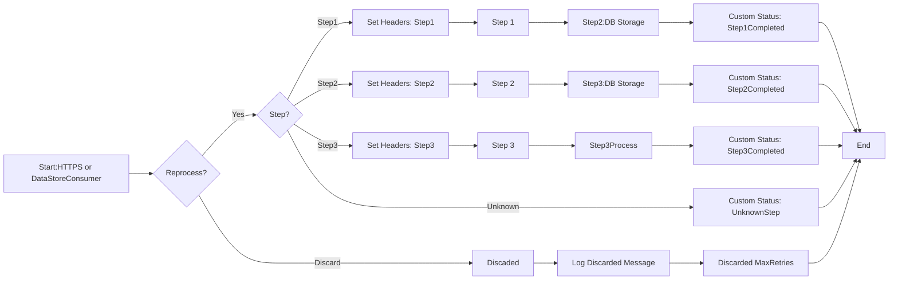

**iFlowId**: SEDA_Model_-_Single_DS_-_Restart_and_Discard - **iFlowVersion**: 1.0.0

**Mermaid Diagram**

**Functional Summary**
- **Brief description of the iFlow**
This iFlow processes messages retrieved from a Data Store, routes them through different steps (Step 1, Step 2, Step 3) based on the 'Step' header, and stores the message in the Data Store after each step. It includes retry logic, discarding messages that exceed the maximum retry attempts, and logging exceptions. Two different start events are available (Postman, DataStoreConsumer)

- **Involved systems**
    - DS (Data Store)
    - Postman

- **Used Adapters**
    - HTTPS
    - DataStoreConsumer

- **Key steps**
 1. The iFlow starts either via an HTTPS endpoint (triggered by Postman) or by consuming messages from a DataStore.
 2.  If started via HTTPS, sets initial headers.
 3. If started by DataStore, it checks if a re-processing is required and has not exceed MaxRetries
 4. Messages are routed based on the 'Step' header value (Step1, Step2, Step3, or Unknown).
 5. Each step (Step 1, Step 2, Step 3) prepares the message, stores it in the Data Store.
 6.  Custom statuses are added to the message processing log after each step.
 7. If MaxRetries is exceed, the message is discarded with custom discarded message in the log.
 8. Exceptions are caught and logged asynchronously.

- **Message transformation**
    - Setting headers (SAP_Sender, SAP_Receiver, SAP_MessageType, Step).
    - Adding custom statuses to the message processing log.
    - Enriching messages with constant values.
    - Groovy scripts for logging exceptions and discarded messages.

- **Externalized parameters list and their descriptions**
    - RoleName:  Role for HTTPS sender authentication.
    - Maximum Retry Interval: Maximum retry interval for DataStore consumer.
    - Exponential Backoff: Exponential backoff flag for DataStore consumer.
    - Data Store Name: Name of the Data Store.
    - Poll Interval: Poll interval for DataStore consumer.
    - Retry Interval: Retry interval for DataStore consumer.
    - Lock Timeout: Lock timeout for DataStore consumer.
    - Retention Threshold 4 Alerting: Retention threshold for DataStore alert.
    - Expiration Period: Expiration period for stored messages.
    - MaxRetries: Maximum retries allowed

- **DataStore / JMS Dependency**
Yes

- **Cloud Connector Dependency**
Not Found

- **Common Scripts Dependency**
    - Log_Discarded_Message.groovy
    - Log_Exception_Async.groovy
    - script1.groovy

- **Cloud Integration Process Direct ComponentType Dependency**
    - Process_40 (Step 2)
    - Process_44 (Step 3)
    - Process_36 (Step 1)
    - Process_12079804 (Log Async Exception)