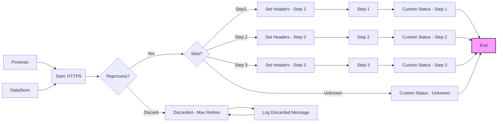

**iFlowId**: SEDA_Model_-_Single_DS_-_Restart_and_Discard - **iFlowVersion**: 1.0.0

**Mermaid Diagram**

**Functional Summary**
- **Brief description of the iFlow**
This iFlow demonstrates a SEDA (Staged Event-Driven Architecture) pattern with a single DataStore consumer. It processes messages in multiple steps, persisting data to a DataStore at each step. The iFlow includes error handling with logging and a retry mechanism. Messages exceeding the maximum retry limit are discarded. It includes exception subprocesses for logging exceptions.

- **Involved systems**
    - Postman
    - DataStore (DS)

- **Used Adapters**
    - HTTPS
    - DataStore Consumer

- **Key steps**
1.  Receive message via HTTPS.
2.  Set initial headers.
3.  Store the message in the DataStore (Step1).
4.  Route the message based on the "Step" header.
5.  Process steps based on the "Step" header (Step1, Step2, Step3).
6.  Each Step updates the "Step" header.
7.  Each Step stores the message in the DataStore (Step2, Step3).
8.  If the "Step" header is unknown, set a custom status.
9.  Retry mechanism implemented.  If max retries exceed, message discarded.
10. Log discarded message.

- **Message transformation**
    - Header enrichment to set sender, receiver, message type, and Step.
    - Header enrichment to set custom status messages indicating step completion or exceptions.
    - Groovy scripts for logging exceptions and discarded messages.
    - Prepare steps: Step 1, Step 2, Step 3 enricher to populate content.

- **Externalized parameters list and their descriptions**
    - RoleName: User role for HTTPS sender authentication.
    - Maximum Retry Interval: Maximum interval for DataStore retry mechanism.
    - Exponential Backoff: Flag to enable exponential backoff for the DataStore retry.
    - Data Store Name: Name of the DataStore used for persistence.
    - Poll Interval: Interval for polling the DataStore.
    - Retry Interval: Interval for retrying DataStore operations.
    - Lock Timeout: Timeout for DataStore lock.
    - Retention Threshold 4 Alerting: Retention threshold for alerting on data in the DataStore.
    - Expiration Period: Expiration period for data stored in the DataStore.
    - MaxRetries: Maximum number of retries before discarding the message.

- **DataStore / JMS Dependency**
Yes

- **Cloud Connector Dependency**
Not Found

- **Common Scripts Dependency**
List of scripts:
    - Log_Discarded_Message.groovy
    - Log_Exception_Async.groovy
    - script1.groovy

- **Process Direct Dependency**
List of PD dependencies:
    - Process_44
    - Process_40
    - Process_36
    - Process_12079804