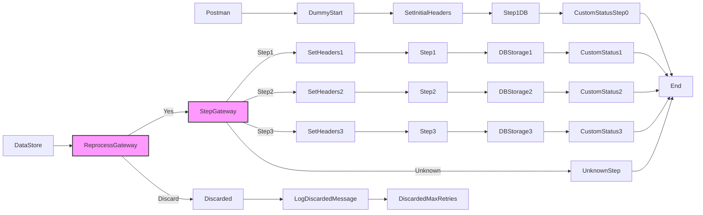

**iFlowId**: SEDA_Model_-_Single_DS_-_Restart_and_Discard - **iFlowVersion**: 1.0.0

**Mermaid Diagram**

**Functional Summary**
- **Brief description of the iFlow**
The iFlow processes messages retrieved from a Data Store, executes three processing steps (Step 1, Step 2, Step 3) and persist intermediate results back to the Data Store. The flow handles exceptions in each step, logging them asynchronously. The flow incorporates a retry mechanism and a discard policy based on the 'MaxRetries' parameter. The iFlow supports re-processing from the beginning or discarding the message if the retry limit is reached.

- **Involved systems**
    - DS
    - Postman

- **Used Adapters**
    - HTTPS
    - DataStoreConsumer

- **Key steps**
 1. The flow starts with a DataStore Consumer that retrieves messages from the data store, or an HTTPS endpoint that triggers the flow for testing purposes.
 2. An Exclusive Gateway checks if the message should be reprocessed or discarded based on the `SAP_DataStoreRetries` header and `MaxRetries` parameter. If the number of retries exceeds `MaxRetries`, the message is discarded.
 3. The flow uses another Exclusive Gateway that route the message to one of the 3 steps, based on the Step Header.
 4. Each step calls a Local Integration Process. Inside the Local Integration Process message headers are prepared before persisting message into the Data Store using DBStorage.
 5. Each step has an error subprocess which logs error information about the async process.
 6. After each local integration process a custom status is set, including details about the step.
 7. After the steps, the iFlow reaches the end.

- **Message transformation**
    - Set Headers in "Dummy Start" process: Sets initial headers including SAP_Sender, SAP_Receiver, SAP_MessageType and Step.
    - "Prepare Step" Enrichers (Step 1, Step 2, Step 3) add a header value for Step.
    - Custom Status enrichers are used to set custom processing log statuses.
    - Set Headers in SEDA Router process: Sets the SAP_Sender, SAP_Receiver and SAP_MessageType headers for each respective step.
    - The Wrap Content attribute of the Enricher component "Prepare Step 2" contains XML content to be included in the message.

- **Externalized parameters list and their descriptions**
    - `RoleName`: Role required for accessing the HTTPS endpoint.
    - `Maximum Retry Interval`: Maximum interval between retries for the DataStoreConsumer.
    - `Exponential Backoff`: Flag to enable exponential backoff for retries for the DataStoreConsumer.
    - `Data Store Name`: Name of the Data Store used for message persistence.
    - `Poll Interval`: Interval for polling messages from the DataStoreConsumer.
    - `Retry Interval`: Interval between retries for the DataStoreConsumer.
    - `Lock Timeout`: Timeout for file locking in the DataStoreConsumer.
    - `Retention Threshold 4 Alerting`: Retention threshold for alerting in DB storage.
    - `Expiration Period`: Expiration period for messages in DB storage.
    - `MaxRetries`: Maximum number of retries before discarding the message.

- **DataStore / JMS Dependency**
Yes

- **Cloud Connector Dependency**
Not Found

- **Common Scripts Dependency**
    - Groovy_Logging_Scripts
    - Log_Discarded_Message.groovy
    - Log_Exception_Async.groovy
    - script1.groovy