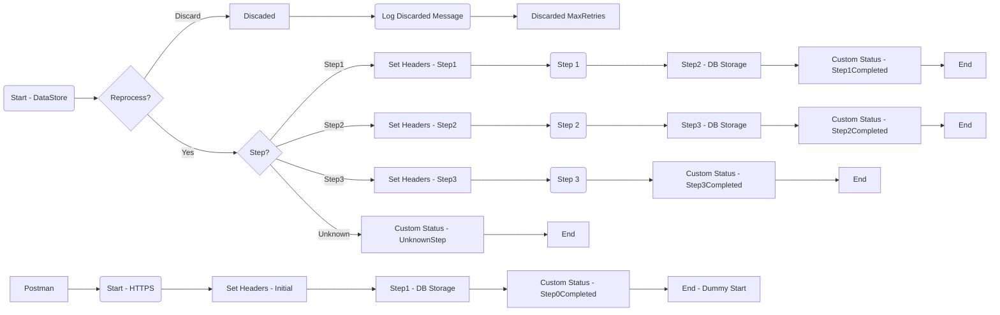

**iFlowId**: SEDA_Model_-_Single_DS_-_Restart_and_Discard - **iFlowVersion**: 1.0.0

**Functional Summary**

-   **Brief description of the iFlow**
    This iFlow demonstrates a SEDA (Staged Event-Driven Architecture) pattern using a Data Store. Messages are retrieved from a Data Store, processed through a series of steps (Step 1, Step 2, Step 3), and custom statuses are logged. The flow includes exception handling for each step. It also shows how to restart the iFlow based on max retries or discard it. The flow has exception subprocesses and a main SEDA Router process.

-   **Involved systems**
    -   DS (DataStore)
    -   Postman

-   **Used Adapters**
    -   DataStoreConsumer (JDBC)
    -   HTTPS

-   **Key steps**
    i.  The iFlow is triggered either by an HTTPS request from Postman, which sets initial headers and saves message to datastore, or by a DataStore consumer.
    ii. A check is performed if the maximum number of retries has been exceeded. If so, the message is discarded.
    iii. The message is routed based on the "Step" header to different processing steps: Step1, Step2, Step3, or an "Unknown" route if the Step header is not recognized.
    iv. Each step ("Step 1", "Step 2", "Step 3") calls a separate integration process to perform specific actions.
    v. Custom status messages are added to the message processing log after each step.

-   **Message transformation**
    -   Enrichers are used to set headers (SAP_Sender, SAP_Receiver, SAP_MessageType, Step) with constant values or expressions.
    -   Scripts are used for logging and discarding messages.
    -   The content of the message is wrapped with "Envelope" tags with information related to the processed step

-   **Externalized parameters list and their descriptions**
    -   `RoleName`: Role required to access the HTTPS endpoint.
    -   `Maximum Retry Interval`: Maximum interval between retries for the DataStore Consumer.
    -   `Exponential Backoff`: Whether to use exponential backoff for DataStore Consumer retries.
    -   `Data Store Name`: Name of the Data Store used.
    -   `Poll Interval`: Polling interval for the DataStore Consumer.
    -   `Retry Interval`: Interval between retries for the DataStore Consumer.
    -   `Lock Timeout`: Timeout for file locking in the DataStore Consumer.
    -   `Retention Threshold 4 Alerting`: Retention threshold for alerting in DB Storage.
    -   `Expiration Period`: Expiration period for the DB Storage.
    -   `MaxRetries`: Maximum number of retries before discarding the message.

-   **DataStore / JMS Dependency**
    Yes

**Mermaid Diagram**

