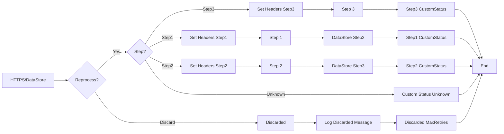

**iFlowId**: SEDA_Model_-_Single_DS_-_Restart_and_Discard - **iFlowVersion**: 1.0.0

**Mermaid Diagram**

**Functional Summary**
- **Brief description of the iFlow**
This iFlow demonstrates a scenario where messages are processed asynchronously via a SEDA router and stored in a Data Store. It handles message reprocessing, discarding messages after a certain number of retries, and logging exceptions. The iFlow is triggered by an HTTPS call or a DataStore event.

- **Involved systems**
    - Postman
    - DS (Data Store)

- **Used Adapters**
    - HTTPS (Sender)
    - DataStoreConsumer (Sender)

- **Key steps**
 1. Receive a message either via HTTPS or from a Data Store. The HTTPS endpoint sets some initial headers.
 2. Save the message in the datastore, setting headers like SAP_Sender, SAP_Receiver, SAP_MessageType and Step
 3. Check if the message needs to be reprocessed. If not, discard the message if max retries reached or route it to step 1, 2 or 3 based on a header.
 4. The message is enriched with a custom status log at various steps (Step1Completed, Step2Completed, Step3Completed)
 5. Each of steps 1 2 and 3 is a subprocess that uses an enricher and can log async exceptions.

- **Message transformation**
    - Set Headers (enricher): Several "Set Headers" enrichers create and set values for headers such as SAP_Sender, SAP_Receiver, SAP_MessageType, and Step.
    - Custom Status (enricher): Multiple "Custom Status" enrichers create custom status messages for logging using expressions based on header values.
    - Step Preparation (enricher): Prepares messages for steps by setting the Step header and wrapping the message content in an envelope.
    - Groovy Script (script): Log Discarded Messages and Async Exceptions

- **Externalized parameters list and their descriptions**
    - RoleName: Role required to access the HTTPS endpoint.
    - Maximum Retry Interval: Maximum time interval between retries when consuming from the Data Store.
    - Exponential Backoff: Flag to enable exponential backoff for retries.
    - Data Store Name: Name of the Data Store used for message persistence.
    - Poll Interval: Time interval to poll the Data Store for new messages.
    - Retry Interval: Time interval between retries when consuming from the Data Store.
    - Lock Timeout: Timeout for file locking when accessing the Data Store.
    - Retention Threshold 4 Alerting: Threshold for retention time, which triggers an alert.
    - Expiration Period: Time after which the message expires in the Data Store.
    - MaxRetries: maximum number of retries before discarding a message.

- **DataStore / JMS Dependency**
Yes

- **Cloud Connector Dependency**
Not Found