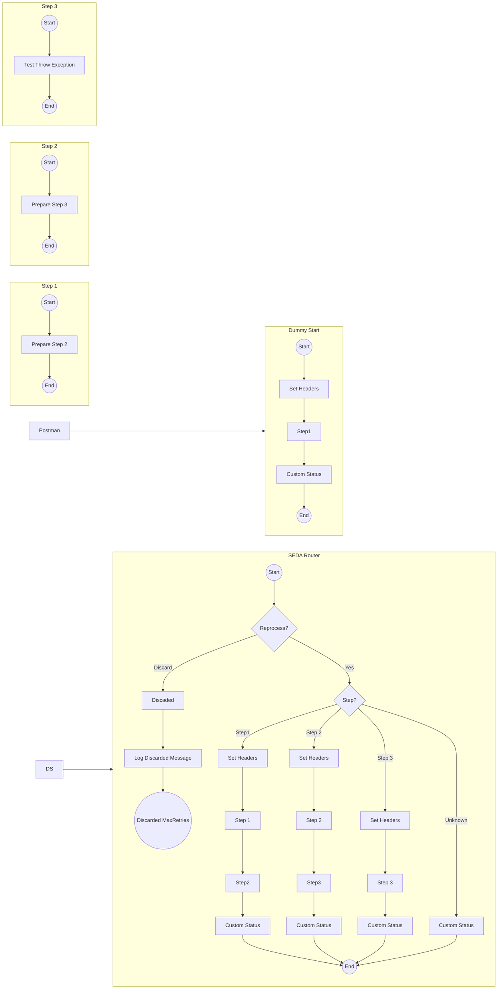

**iFlowId**: SEDA_Model_-_Single_DS_-_Restart_and_Discard - **iFlowVersion**: 1.0.0

**Mermaid Diagram**

**Functional Summary**
- **Brief description of the iFlow**
This iFlow simulates an asynchronous process where messages are picked up from a Data Store, processed through multiple steps, and stored back into the Data Store. It demonstrates error handling, message reprocessing, and discarding messages after a certain number of retries. It leverages SEDA router to handle the process asynchronously.

- **Involved systems**
    - Postman
    - DS (Data Store)

- **Used Adapters**
    - HTTPS
    - DataStoreConsumer

- **Key steps**
    1. Receive message from Postman via HTTPS or from Data Store via DataStoreConsumer.
    2. Determine if message needs to be reprocessed (based on retry logic).
    3. Route message based on "Step" header to appropriate sub-process (Step1, Step2, Step3, or Unknown).
    4. Each step sub-process prepares the message, calls a subsequent sub-process, and updates the Data Store.
    5. If MaxRetries has been reached, message will be discarded and message will be logged.

- **Message transformation**
    - Enricher components are used to set headers and custom message processing log statuses at various stages.
    - Groovy scripts are used for logging discarded messages and exceptions.
    - Message content is transformed to prepare for subsequent steps, particularly in Step 1, Step 2 and Step 3.

- **Externalized parameters list and their descriptions**
    - RoleName: Role required to access the HTTPS endpoint.
    - Maximum Retry Interval: Maximum interval between retries for the DataStoreConsumer.
    - Exponential Backoff: Flag to enable exponential backoff for DataStoreConsumer retries.
    - Data Store Name: Name of the Data Store used for persistence.
    - Poll Interval: Interval for polling the Data Store.
    - Retry Interval: Interval between retries for the DataStoreConsumer.
    - Lock Timeout: Timeout for file lock in DataStoreConsumer.
    - Retention Threshold 4 Alerting: Retention threshold for alerting in datastore.
    - Expiration Period: Expiration Period for message in DataStore.
    - MaxRetries: The maximum number of retries before discarding the message.

- **DataStore / JMS Dependency**
Yes

- **Cloud Connector Dependency**
Not Found