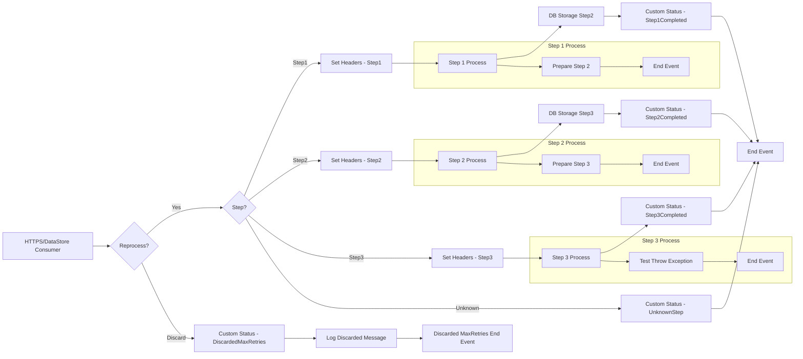

**iFlowId**: SEDA_Model_-_Single_DS_-_Restart_and_Discard - **iFlowVersion**: 1.0.0

**Mermaid Diagram**

**Functional Summary**
- **Brief description of the iFlow**
  This iFlow demonstrates a scenario where messages are read from a Data Store, processed through multiple steps, and then either discarded after exceeding a retry limit or stored back in the Data Store after each step. The steps include "Step 1", "Step 2", and "Step 3", each represented by a separate integration process. Exceptions during processing are logged. The iFlow also includes dummy start and end events for HTTP triggering of the scenario.

- **Involved systems**
  - Postman
  - Data Store (DS)

- **Used Adapters**
  - HTTPS
  - DataStoreConsumer

- **Key steps**
 1. Receive a message via HTTPS (from Postman) or from the Data Store
 2. Check `SAP_DataStoreRetries` header. Discard if it exceeds `MaxRetries`
 3. Based on the `Step` header, route the message to the appropriate step.
 4. Each step (Step 1, Step 2, Step 3) prepares the message for the next step by setting headers and message content.
 5. Store the message back to the Data Store after the related "Step"
 6. Set custom status for each step

- **Message transformation**
  - The iFlow utilizes Enricher components to set headers (SAP_Sender, SAP_Receiver, SAP_MessageType, Step, etc.) and custom message processing log statuses (SAP_MessageProcessingLogCustomStatus). Constant values and expressions are used to populate the headers and status messages. The steps also prepare the message for the next step by setting message content. Groovy scripts are used for logging discarded messages and exceptions.

- **Externalized parameters list and their descriptions**
  - `RoleName`: Role required for the HTTPS sender authentication.
  - `Maximum Retry Interval`: Maximum time interval between retries for Data Store consumption.
  - `Exponential Backoff`: Flag indicating if exponential backoff should be used for Data Store retries.
  - `Data Store Name`: Name of the Data Store used for message persistence.
  - `Poll Interval`: Interval for polling the Data Store.
  - `Retry Interval`: Interval between retries for Data Store consumption.
  - `Lock Timeout`: Timeout for file locking during Data Store operations.
  - `Retention Threshold 4 Alerting`: Retention threshold for alerting.
  - `Expiration Period`: Expiration period for messages in the Data Store.
  - `MaxRetries`: Maximum number of retries before discarding a message.

- **DataStore / JMS Dependency**
  Yes

- **Cloud Connector Dependency**
  Not Found