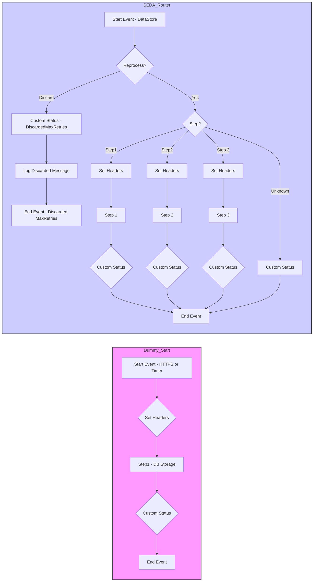

**iFlowId**: SEDA_Model_-_Single_DS_-_Restart_and_Discard - **iFlowVersion**: 1.0.0

**Mermaid Diagram**

**Functional Summary**
**Brief description of the iFlow**
This iFlow implements a SEDA (Staged Event-Driven Architecture) pattern for processing messages retrieved from a DataStore. The iFlow retrieves messages from the DataStore, processes them in multiple steps (Step 1, Step 2, Step 3) and stores intermediate status in the DataStore after every Step. It includes error handling and logging, and it also has a retry mechanism for failed messages, discarding the message if the maximum number of retries is reached. An HTTPS endpoint is available to restart the message processing.

**Involved systems**
- DS (DataStore)
- Postman

**Used Adapters**
- DataStoreConsumer (JDBC)
- HTTPS

**Key steps**
1.  Receive message either via HTTPS endpoint or DataStore.
2.  Check if the maximum number of retries has been exceeded. If so, discard the message.
3.  Route the message based on the 'Step' header to the appropriate processing step (Step 1, Step 2, or Step 3). If the Step header is empty or invalid, route the message to an unknown step path.
4.  Each processing step calls a local integration process (Step 1, Step 2, or Step 3) which enrich the message, then writes the status in DataStore, updates the message processing log with custom status. Exception subprocesses also log async exceptions and set custom status.
5.  Log the message with custom status.

**Message transformation**
- Set Headers: Adds headers like SAP_Sender, SAP_Receiver, SAP_MessageType and Step.
- Enricher: Adds a SAP_MessageProcessingLogCustomStatus using expressions or constant values.
- Groovy Script: "Log_Discarded_Message.groovy" is used for logging discarded messages and "Log_Exception_Async.groovy" is used for logging asynchronous exceptions.
- Enricher: Prepares the next Step by providing a dummy StepXMessage in base64 within an XML envelope.

**Externalized parameters list and their descriptions**
- Data Store Name: Name of the datastore to be used in consumer and storage steps.
- Maximum Retry Interval: Maximum retry interval for datastore consumer.
- Exponential Backoff: Enable exponential backoff for datastore consumer retries (true/false).
- Poll Interval: Interval for polling the DataStore.
- Retry Interval: Retry interval for failed datastore consumer calls.
- Lock Timeout: Timeout for locking datastore entries.
- Retention Threshold 4 Alerting: Retention threshold for alerting in datastore.
- Expiration Period: Expiration period for messages in the datastore.
- RoleName: Role name for HTTPS sender authentication.
- MaxRetries: Maximum number of retries for a message to be processed

**DataStore / JMS Dependency**
Yes

**Cloud Connector Dependency**
Not Found