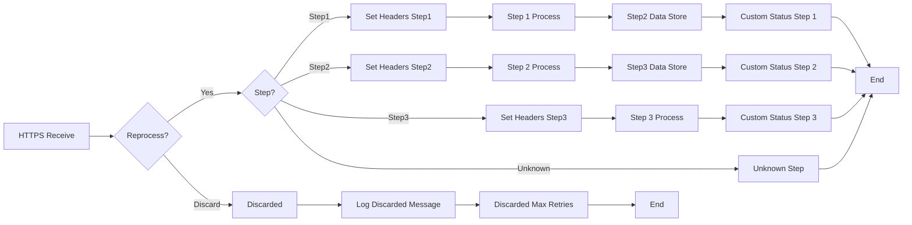

**iFlowId**: SEDA_Model_-_Single_DS_-_Restart_and_Discard - **iFlowVersion**: 1.0.0

**Mermaid Diagram**

**Functional Summary**
- **Brief description of the iFlow**
This iFlow implements a SEDA (Staged Event-Driven Architecture) pattern for asynchronous message processing with data store persistence, retry mechanism, and discarding of messages after exceeding the maximum retry limit. It receives messages via HTTPS, stores them in a Data Store, and processes them in three steps.

- **Involved systems with Adapters Type and Endpoint Type**
    - Postman: HTTPS (EndpointSender)
    - DS: DataStoreConsumer (EndpointSender)

- **Key steps**
    1. Receives a message via HTTPS endpoint.
    2. Sets initial headers (SAP_Sender, SAP_Receiver, SAP_MessageType, Step).
    3. Stores the message in the Data Store.
    4. Updates message processing log with custom status.
    5. Routes the message to Step1, Step2, or Step3 processes based on the "Step" header value.
    6. Each Step process prepares a message for the subsequent step and may throw an exception.
    7. If an exception occurs, it logs the exception.
    8. After completing each step, the message processing log is updated.
    9. If the message fails and exceeds the maximum retry attempts, the message is discarded.
    10. Logs the discarded message if max retries are exceeded and discards the message.

- **Message transformation**
    - Set Headers: Used in multiple steps to create and set headers (SAP_Sender, SAP_Receiver, SAP_MessageType, Step) with constant values.
    - Custom Status: Used to create custom status in Message Processing Log, using a mix of constant and expression values (e.g. `${header.SAP_MessageType} - Step0Completed`).
    - Prepare Step 2 & Step 3: Enricher to add Step values to the header.
    - Groovy Script: Log Discarded Message, Log Exception Async.

- **Externalized parameters list and their descriptions**
    - RoleName: Role required to access the HTTPS endpoint.
    - Maximum Retry Interval: Maximum interval for retry attempts.
    - Exponential Backoff: Flag indicating if exponential backoff is enabled for retries.
    - Data Store Name: Name of the Data Store used for persistence.
    - Poll Interval: Interval for polling the Data Store.
    - Retry Interval: Interval for retrying failed messages.
    - Lock Timeout: Timeout for Data Store lock.
    - Retention Threshold 4 Alerting: Threshold for alerting based on retention.
    - Expiration Period: Period after which the data expires.
    - MaxRetries: Maximum number of retries before discarding the message.

- **DataStore / JMS Dependency**
Yes

- **Cloud Connector Dependency**
Not Found

- **Common Scripts Dependency**
    - Log_Discarded_Message.groovy
    - Log_Exception_Async.groovy

- **ProcessDirect ComponentType Dependency**
Not Found