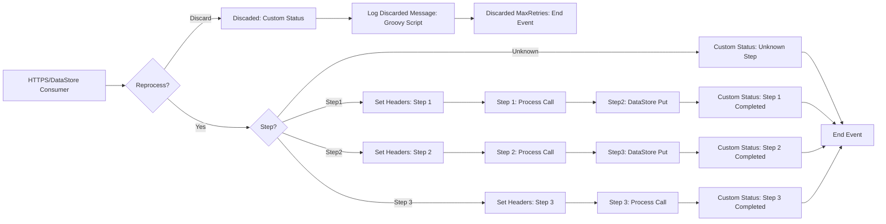

**iFlowId**: SEDA_Model_-_Single_DS_-_Restart_and_Discard - **iFlowVersion**: 1.0.0

**Functional Summary**

-   **Brief description of the iFlow**
    This iFlow demonstrates a SEDA (Staged Event-Driven Architecture) pattern for processing messages. It retrieves messages from a Data Store, processes them through a series of steps (Step 1, Step 2, Step 3), and handles potential exceptions at each step. The iFlow includes retry logic and a mechanism to discard messages that exceed the maximum retry attempts. It also has a separate process for logging Async Exceptions. The dummy start process shows how a HTTPs call is used to start this iFlow.

-   **Involved systems**
    -   DS (Data Store)
    -   Postman

-   **Used Adapters**
    -   DataStoreConsumer (JDBC)
    -   HTTPS

-   **Key steps**
    i.  Receive message via HTTPS (Postman) or DataStore Consumer (DS).
    ii. Route the message to "Step1" Datastore.
    iii. Sets various message headers (SAP_Sender, SAP_Receiver, SAP_MessageType, Step).
    iv.  Persists the message to the datastore.
    v.  Routes the message based on the `Step` header.
    vi. Calls the corresponding "Step" process (Step 1, 2 or 3).
    vii. Updates message processing log custom status with step completion
    viii. Sends the message to the end event.
    ix. Implements retry logic and discards messages exceeding maximum retries.
    x. If the data store fails it calls "Log Async Exception" process to handle the exception.

-   **Message transformation**
    -   `Set Headers` (Enricher): Sets headers like `SAP_Sender`, `SAP_Receiver`, `SAP_MessageType`, and `Step` based on the current processing stage.
    -   `Custom Status` (Enricher): Adds custom status messages to the processing log, indicating the completion of each step or the occurrence of an exception.
    -   `Prepare Step` (Enricher): Wraps the message in an Envelope to be processed by the next step.

-   **Externalized parameters list and their descriptions**
    -   `RoleName`: Role required for the HTTPS sender authentication.
    -   `Maximum Retry Interval`: Maximum time interval between retries for the DataStoreConsumer.
    -   `Exponential Backoff`: Boolean flag to enable exponential backoff for retries.
    -   `Data Store Name`: Name of the Data Store used for message persistence.
    -   `Poll Interval`: Time interval for polling the Data Store.
    -   `Retry Interval`: Time interval between retries for the DataStoreConsumer.
    -   `Lock Timeout`: Timeout for file lock in the DataStoreConsumer.
    -   `Retention Threshold 4 Alerting`: Threshold for retention period before alerting.
    -   `Expiration Period`: Time period after which the data expires in the data store.
    -   `MaxRetries`: Maximum number of retries before discarding the message.

-   **DataStore / JMS Dependency**
    Yes

**Mermaid Diagram**

