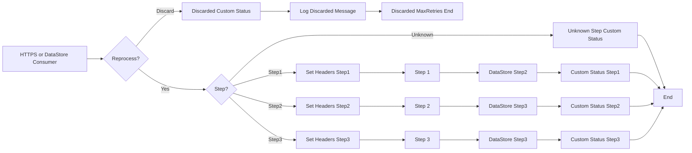

**iFlowId**: SEDA_Model_-_Single_DS_-_Restart_and_Discard - **iFlowVersion**: 1.0.0
**Mermaid Diagram**

**Functional Summary**
- **Brief description of the iFlow**
This iFlow demonstrates a SEDA (Staged Event-Driven Architecture) pattern with a single Data Store. It retrieves messages from a Data Store, processes them through a series of steps (Step 1, Step 2, Step 3), and includes error handling with asynchronous exception logging. It also demonstrates restart and discard logic based on the number of retries. The flow is triggered either via HTTPS or DataStore Consumer adapter.

- **Involved systems**
    - Postman
    - DS (DataStore)

- **Used Adapters**
    - HTTPS
    - DataStoreConsumer

- **Key steps**
    1.  Receive message from HTTPS endpoint or DataStore.
    2.  Check if the message should be reprocessed based on `SAP_DataStoreRetries` header against the `MaxRetries` parameter. If the header exceeds the configured limit, it routes message to discard path.
    3.  If reprocesssing is needed, route the message to one of the steps based on the `Step` header value.
    4.  Each step (Step 1, Step 2, Step 3) enriches the message and persists it to a Data Store and updates MPL Custom Status
    5.  If a step encounters an exception, the exception is logged asynchronously.
    6.  If the number of retries exceeds a maximum, the message is discarded after logging the discarded message.
    7. Custom statuses are added at several steps along the way

- **Message transformation**
    - The iFlow enriches the message with headers such as `SAP_Sender`, `SAP_Receiver`, `SAP_MessageType`, and `Step` using Enricher components.
    - The MPL custom status is updated at various points in the flow

- **Externalized parameters list and their descriptions**
    - `RoleName`: Role required to access the HTTPS endpoint.
    - `Maximum Retry Interval`: Maximum interval for retries with exponential backoff.
    - `Exponential Backoff`: Flag to enable exponential backoff for retries.
    - `Data Store Name`: Name of the Data Store used for persistence.
    - `Poll Interval`: Interval for polling the Data Store.
    - `Retry Interval`: Interval for retrying failed Data Store operations.
    - `Lock Timeout`: Timeout for file locking in the Data Store.
    - `Retention Threshold 4 Alerting`: Threshold for triggering alerts based on data retention.
    - `Expiration Period`: Time period after which data in the Data Store expires.
    - `MaxRetries`: Maximum number of retries before discarding the message.

- **DataStore / JMS Dependency**
Yes