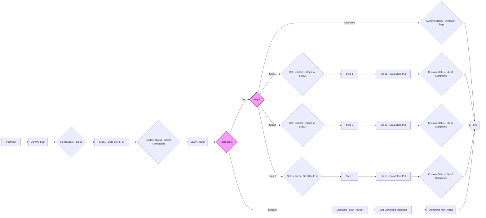

**iFlowId**: SEDA_Model_-_Single_DS_-_Restart_and_Discard - **iFlowVersion**: 1.0.0

**Mermaid Diagram**

**Functional Summary**
- **Brief description of the iFlow**
The iFlow processes messages asynchronously, persisting them to a Data Store and retrying in case of failures. It involves multiple steps, each potentially throwing exceptions, with a mechanism for logging these exceptions. Messages can be discarded after a certain number of retries.

- **Involved systems**
  - Postman
  - Data Store (DS)

- **Used Adapters**
  - HTTPS (Sender)
  - DataStoreConsumer (Sender)

- **Key steps**
 1. Receive message via HTTPS from Postman (Dummy Start).
 2. Set initial headers, including sender, receiver, and message type (Set Headers in Dummy Start).
 3. Persist the message to the Data Store (Step1 in Dummy Start).
 4. Retrieve message from Data Store (Start in SEDA Router).
 5. Determine if message should be discarded, based on number of retries (ExclusiveGateway_9098 in SEDA Router). If `SAP_DataStoreRetries` exceeds `MaxRetries`, discard message.
 6. Based on value of the header `Step`, route the message for processing (ExclusiveGateway_12 in SEDA Router).
 7. Prepare and execute "Step 1", prepare headers and set `Step=Step2` (Integration Process Step 1 and associated subprocesses, called by SEDA Router).
 8. Prepare and execute "Step 2", prepare headers and set `Step=Step3` (Integration Process Step 2 and associated subprocesses, called by SEDA Router).
 9. Prepare and execute "Step 3", prepare headers and set `Step=EndMessage` (Integration Process Step 3 and associated subprocesses, called by SEDA Router).
 10. Log Async Exception (Log Async Exception Process, called in exception subprocesses in Integration Process Step 1, 2 and 3).
 11. Discard Message (Log Discarded Message and Discarded MaxRetries End Event in SEDA Router).
 12. Update custom status messages throughout the flow.

- **Message transformation**
  - Setting Headers: Several "Set Headers" steps enrich the message with sender, receiver, message type, and step information.
  - Custom Status: Several "Custom Status" steps enrich the message with processing status information.
  - Groovy Script: Log discarded message to persistent storage

- **Externalized parameters list and their descriptions**
  - RoleName: User role for HTTPS sender authentication.
  - Maximum Retry Interval: Maximum interval between retries for DataStoreConsumer.
  - Exponential Backoff: Flag to enable exponential backoff for DataStoreConsumer retries.
  - Data Store Name: Name of the Data Store used for persistence.
  - Poll Interval: Interval for polling the Data Store for new messages.
  - Retry Interval: Interval between retries for DataStoreConsumer.
  - Lock Timeout: Timeout for file lock in DataStoreConsumer.
  - Retention Threshold 4 Alerting: Threshold for alerting on data retention.
  - Expiration Period: Period after which data expires.
  - MaxRetries: Maximum number of retries before discarding a message.

- **DataStore / JMS Dependency**
Yes

- **Cloud Connector Dependency**
Not Found