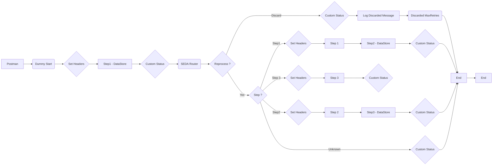

**iFlowId**: SEDA_Model_-_Single_DS_-_Restart_and_Discard - **iFlowVersion**: 1.0.0

**Mermaid Diagram**

**Functional Summary**
- **Brief description of the iFlow**
This iFlow implements a SEDA (Staged Event-Driven Architecture) pattern to process messages asynchronously, retrieving them from a Data Store, routing them through multiple processing steps (Step 1, Step 2, Step 3) and handling exception using dedicated subprocesses. The flow includes retry mechanism, and the possibility to discard messages after a specific number of retries.

- **Involved systems**
    - Postman
    - DS (DataStore)

- **Used Adapters**
    - HTTPS
    - DataStore Consumer

- **Key steps**
 1. Receives a message via HTTPS.
 2. Saves the message to a Data Store.
 3. Consumes the message from the Data Store.
 4. Routes the message based on the `Step` header value ("Step1", "Step2", "Step3").
 5. Executes corresponding steps (Step 1, Step 2, Step 3) based on the `Step` header.
 6. Each step updates message processing log custom status.
 7. Saves the status (Step1, Step2, Step3) with separate Data Store operations.
 8. Implements a retry mechanism. If the number of retries exceeds a predefined limit (`MaxRetries`), the message is discarded.
 9. Logs Async Exceptions.
10. Sets Headers with Enrichers.

- **Message transformation**
    - Set Headers (Enricher): Adds `SAP_Sender`, `SAP_Receiver`, `SAP_MessageType`, and `Step` headers.
    - Prepare Step x (Enricher): Sets the Step headers, and wrap content as base64.
    - Custom Status (Enricher): Sets custom status messages in the `SAP_MessageProcessingLogCustomStatus` header.
- **Externalized parameters list and their descriptions**
    - `RoleName`: Role required for accessing the HTTPS endpoint.
    - `Maximum Retry Interval`: Maximum retry interval for DataStore Consumer
    - `Exponential Backoff`: Exponential Backoff parameter for DataStore Consumer
    - `Data Store Name`: Name of the Data Store used for persistence.
    - `Poll Interval`: Poll Interval parameter for DataStore Consumer
    - `Retry Interval`: Retry Interval parameter for DataStore Consumer
    - `Lock Timeout`: Lock Timeout parameter for DataStore Consumer
    - `Retention Threshold 4 Alerting`: Retention Threshold for Alerting parameter for DB storage.
    - `Expiration Period`: Expiration Period for DB storage.
    - `MaxRetries`: Maximum number of retries.

- **DataStore / JMS Dependency**
Yes

- **Cloud Connector Dependency**
Not Found

- **Common Scripts Dependency**
List of scripts:
    - Log_Discarded_Message.groovy
    - Log_Exception_Async.groovy
    - script1.groovy

- **ProcessDirect ComponentType Dependency**
Not Found