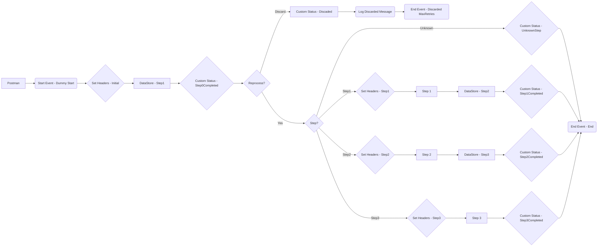

**iFlowId**: SEDA_Model_-_Single_DS_-_Restart_and_Discard - **iFlowVersion**: 1.0.0

**Functional Summary**

- **Brief description of the iFlow**
This iFlow processes messages using a SEDA (Staged Event-Driven Architecture) router and interacts with a Data Store. It includes steps for processing messages, handling exceptions, and managing message retries before discarding messages that exceed the maximum retry limit.

- **Involved systems**
    - Postman
    - DS (DataStore)

- **Used Adapters**
    - HTTPS
    - DataStore Consumer

- **Key steps**
    1. Receive message via HTTPS.
    2. Set initial headers (SAP_Sender, SAP_Receiver, SAP_MessageType, Step).
    3. Store the message in DataStore (Step1).
    4. Route based on the 'Step' header.
    5. Process message based on the 'Step' header:
        - Step1: Prepare and execute Step 1, then store the message in DataStore (Step2).
        - Step2: Prepare and execute Step 2, then store the message in DataStore (Step3).
        - Step3: Prepare and execute Step 3.
    6. If MaxRetries have been reached, the message is discarded.
    7. Log the message.
    8. Set custom status messages at various stages.
    9. Handle exceptions by logging them.

- **Message transformation**
    - Header enrichment is used to set SAP-specific headers like SAP_Sender, SAP_Receiver, SAP_MessageType, Step, and SAP_MessageProcessingLogCustomStatus.
    - Some transformations involve setting message bodies to constants or expressions for logging purposes.
    - Groovy scripts are used for logging exceptions and discarded messages.

- **Externalized parameters list and their descriptions**
    - `RoleName`: User role for HTTPS sender authentication.
    - `Maximum Retry Interval`: Maximum interval for DataStore retries.
    - `Exponential Backoff`: Boolean value to enable/disable exponential backoff.
    - `Data Store Name`: Name of the DataStore to be used.
    - `Poll Interval`: Poll interval for DataStore consumer.
    - `Retry Interval`: Retry interval for DataStore consumer.
    - `Lock Timeout`: Lock timeout for DataStore consumer.
    - `Retention Threshold 4 Alerting`: Threshold for alerting on data retention.
    - `Expiration Period`: Expiration period for data in the DataStore.
    - `MaxRetries`: Maximum number of retries before discarding the message.

- **DataStore / JMS Dependency**
Yes

**Mermaid Diagram**

