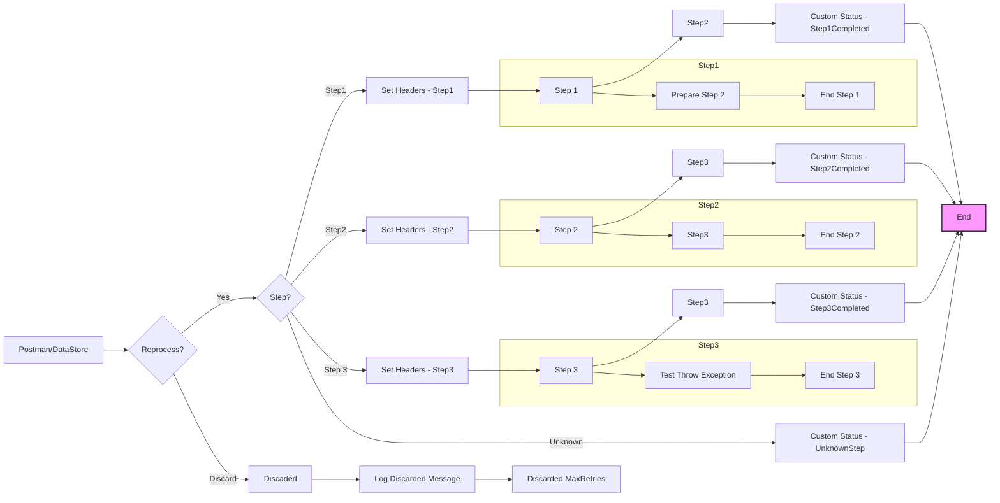

**iFlowId**: SEDA_Model_-_Single_DS_-_Restart_and_Discard - **iFlowVersion**: 1.0.0

**Mermaid Diagram**

**Functional Summary**
- **Brief description of the iFlow**
  This iFlow demonstrates a SEDA (Staged Event-Driven Architecture) model with a single Data Store, restart, and discard functionality. It receives messages either via HTTPS or DataStore. The core logic routes messages through three steps, storing message data in the Data Store and logging async exceptions, discarding messages that exceed maximum retry attempts.

- **Involved systems**
  - Postman
  - DS (DataStore)

- **Used Adapters**
  - HTTPS (Sender)
  - DataStore Consumer (Sender)

- **Key steps**
  1. Receive message via HTTPS or DataStore Consumer.
  2. Determine if the message should be reprocessed or discarded based on retry count.
  3. Route message to Step1, Step2 or Step3 based on message header "Step" value
  4. Store message in data store (Step1, Step2, Step3).
  5. Log any exceptions during steps in the Log Async Exception process.
  6. Discard message if maximum retry count is reached by logging discaded message.

- **Message transformation**
  - Setting headers in "Set Headers" steps.
  - Adding custom status messages in "Custom Status" steps.
  - Enriching message content in "Prepare Step" activities within the Step subprocesses.

- **Externalized parameters list and their descriptions**
  - RoleName: Role required to access the HTTPS endpoint.
  - Maximum Retry Interval: Maximum interval for retries.
  - Exponential Backoff: Flag to enable exponential backoff for retries.
  - Data Store Name: Name of the data store used for message persistence.
  - Poll Interval: Interval for polling the Data Store.
  - Retry Interval: Interval for retrying failed operations.
  - Lock Timeout: Timeout for file lock operations.
  - Retention Threshold 4 Alerting: Threshold for retention period alerting.
  - Expiration Period: Period after which messages expire.
  - MaxRetries: Maximum number of retries before discarding a message.

- **DataStore / JMS Dependency**
  Yes