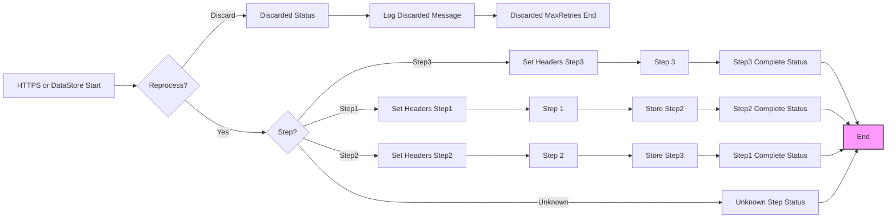

**iFlowId**: SEDA_Model_-_Single_DS_-_Restart_and_Discard - **iFlowVersion**: 1.0.0

**Mermaid Diagram**

**Functional Summary**
- **Brief description of the iFlow**
This iFlow demonstrates a SEDA (Staged Event-Driven Architecture) pattern using a Data Store for persistence. It receives messages, processes them through a series of steps (Step 1, Step 2, Step 3), and manages retries and discards based on configurable parameters. Exceptions during the processing steps are caught and logged asynchronously. There are 2 start points, one triggered by HTTPS, one from DataStore.

- **Involved systems**
    - Postman
    - DS (DataStore)

- **Used Adapters**
    - HTTPS
    - DataStore Consumer

- **Key steps**
    1. Receive message from HTTPS or DataStore. The HTTPS receiver is Dummy start, and DataStore consumer is the main entry point.
    2. Set headers for initial processing (Dummy Start only).
    3. Store the message in DataStore (Step1, Step2, Step3).
    4. Route the message through steps Step1, Step2, Step3 sequentially, retrying if necessary.
    5. Discard messages exceeding the maximum retry count, logging the discarded message.
    6. Log exceptions that occur in any step asynchronously.
    7. Set Custom Status on success and exception for monitoring.

- **Message transformation**
    - The iFlow uses enrichers to add headers and custom status to the message.
    - Step 2 prepares for Step 3 using enricher to add step header.
    - Step 1 prepares for Step 2 using enricher to add step header.
    - Groovy scripts are used for logging discarded messages and exceptions.

- **Externalized parameters list and their descriptions**
    - RoleName: Role required for accessing the HTTPS endpoint.
    - Maximum Retry Interval: Maximum interval between retries for DataStore consumer.
    - Exponential Backoff: Whether to use exponential backoff for DataStore consumer retries.
    - Data Store Name: Name of the DataStore used for persistence.
    - Poll Interval: Polling interval for the DataStore consumer.
    - Retry Interval: Interval between retries for the DataStore consumer.
    - Lock Timeout: Timeout for the DataStore consumer lock.
    - Retention Threshold 4 Alerting: Threshold for triggering alerts related to message retention.
    - Expiration Period: Time period after which messages in the DataStore expire.
    - MaxRetries: Maximum number of retries before discarding the message.

- **DataStore / JMS Dependency**
Yes

- **Cloud Connector Dependency**
Not Found