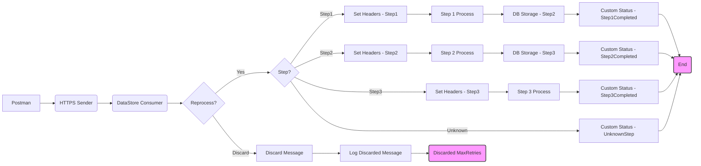

**iFlowId**: SEDA_Model_-_Single_DS_-_Restart_and_Discard - **iFlowVersion**: 1.0.0

**Functional Summary**

-   **Brief description of the iFlow**
    This iFlow implements a SEDA (Staged Event-Driven Architecture) pattern to process messages asynchronously using a Data Store. It retrieves messages from a Data Store, processes them in three steps (Step 1, Step 2, Step 3), stores intermediate states in the Data Store and upon defined failure thresholds (MaxRetries), the message is discarded, also including error handling and logging capabilities. The flow starts by receiving a request from Postman.

-   **Involved systems**
    -   Postman (Sender)
    -   Data Store (DS)

-   **Used Adapters**
    -   HTTPS (Sender)
    -   DataStoreConsumer (Sender)

-   **Key steps**
    1.  Receive a message from Postman via HTTPS.
    2.  Store headers to the message.
    3.  Store Message into the DataStore.
    4.  Retrieve message from Data Store.
    5.  Check Retry Count (`SAP_DataStoreRetries` header). If the retry count exceeds `MaxRetries`, discard the message.
    6.  Call Step 1, Step 2, and Step 3 local integration processes for processing.
    7.  Store message in the DataStore after each step.
    8.  Set custom statuses to the message processing log.
    9.  Handle exceptions in each step, logging errors asynchronously.

-   **Message transformation**
    -   The iFlow uses "Enricher" steps (Call Activities) to set message headers and custom statuses to the log.
    -   Groovy scripts are used for logging discarded messages and exceptions.

-   **Externalized parameters list and their descriptions**
    -   `RoleName`: The user role required to access the HTTPS endpoint.
    -   `Maximum Retry Interval`: The maximum interval between retries for the DataStoreConsumer.
    -   `Exponential Backoff`: Indicates whether exponential backoff is used for DataStoreConsumer retries.
    -   `Data Store Name`: The name of the Data Store used to persist messages.
    -   `Poll Interval`: The interval between polls to the Data Store
    -   `Retry Interval`: The interval between retries for the DataStoreConsumer.
    -   `Lock Timeout`: Timeout to acquire lock to consume message from datastore
    -   `Retention Threshold 4 Alerting`: Retention period for messages before alerting.
    -   `Expiration Period`: The time period after which messages expire in the Data Store.
    -   `MaxRetries`: The maximum number of retries allowed before discarding the message.

-   **DataStore / JMS Dependency**
    Yes

**Mermaid Diagram**

