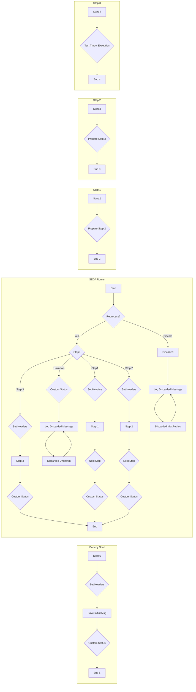

**iFlowId**: SEDA_Model_-_Single_Queue_-_Restart_and_Discard - **iFlowVersion**: 1.0.0

**Mermaid Diagram**

**Functional Summary**
- **Brief description of the iFlow**
This iFlow demonstrates a SEDA (Staged Event-Driven Architecture) pattern using a single JMS queue. It receives messages, processes them in multiple steps (Step 1, Step 2, Step 3), and handles exceptions during each step by logging them. The iFlow also includes retry logic with a maximum number of retries and discards messages that exceed this limit or encounter unknown steps.

- **Involved systems**
    - SQUEUE
    - Postman
    - RQUEUE

- **Used Adapters**
    - JMS
    - HTTPS

- **Key steps**
    1.  Receive a message via HTTPS (from Postman) or JMS (from SQUEUE).
    2.  Save the initial message and set headers.
    3.  Route the message to Step 1, Step 2 or Step 3, depending on the `Step` property.
    4.  Each step (Step 1, Step 2, Step 3) prepares the message for the next step by setting properties and headers.
    5.  If an exception occurs in any of the steps, log the exception asynchronously.
    6.  If the message has been reprocessed more than the maximum retries, discard it and log discarded message.
    7.  If message `Step` value is unknown, discard the message and log discarded message.

- **Message transformation**
    - Setting headers (SAP_Sender, SAP_Receiver, SAP_MessageType) using enrichers with constant values.
    - Setting custom status messages (SAP_MessageProcessingLogCustomStatus) using enrichers.
    - Preparing message content for subsequent steps within each "Prepare Step" call activity.
    - Logging discarded messages using Groovy scripts.
    - Logging exceptions using Groovy scripts.

- **Externalized parameters list and their descriptions**
    - `SEDA_MAIN_QUEUE`: The name of the JMS queue used for message processing.
    - `Retention Threshold 4 Alerting`: Threshold for alerting on message retention.
    - `Expiration Period`: The time after which messages expire.
    - `Number of Concurrent Processes`: Number of concurrent processes for JMS adapter.
    - `Maximum Retry Interval`: Maximum retry interval for JMS adapter.
    - `Retry Interval`: Retry interval for JMS adapter.
    - `MaxRetries`: Maximum number of retries before discarding a message.

- **DataStore / JMS Dependency**
Yes

- **Cloud Connector Dependency**
Not Found