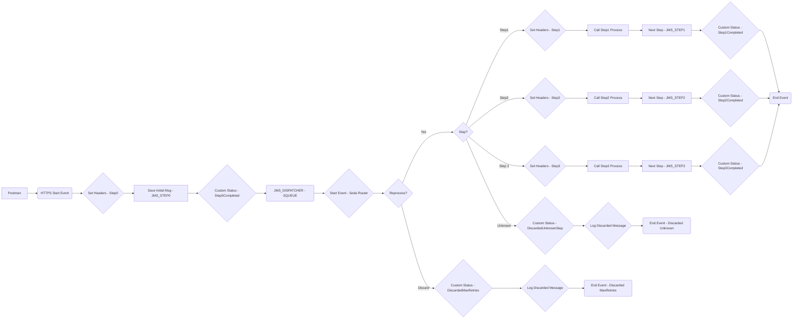

**iFlowId**: SEDA_Model_-_Single_Queue_-_Restart_and_Discard - **iFlowVersion**: 1.0.0

**Functional Summary**

- **Brief description of the iFlow**
This iFlow implements a SEDA (Staged Event-Driven Architecture) pattern with a single JMS queue. It receives messages, processes them in multiple steps, and handles exceptions by logging them and discarding messages after a maximum number of retries or in case of unknown steps. Messages are passed through three integration processes (Step 1, Step 2, Step 3) before completion.

- **Involved systems**
    - SQUEUE
    - RQUEUE
    - Postman

- **Used Adapters**
    - JMS
    - HTTPS

- **Key steps**
    1. Receive message via JMS from SQUEUE.
    2. Determine the next step based on the `Step` property.
    3. Based on the Step property, set headers using Enrichers
    4. Call the corresponding integration process (Step 1, Step 2, or Step 3).
    5. Within each Step Process set property 'Step', prepare payload using Enricher component. Throw exception in Step 3.
    6. After each Step, call the next Send component using JMS Adapter to persist the message in SEDA_MAIN_QUEUE for next Step Process.
    7. Log exceptions and discard messages after maximum retries or in case of an unknown step.

- **Message transformation**
    - Header enrichment using Enricher components to set routing information (`SAP_Sender`, `SAP_Receiver`, `SAP_MessageType`).
    - Payload preparation within each step using Enricher components.

- **Externalized parameters list and their descriptions**
    - `SEDA_MAIN_QUEUE`: The name of the JMS queue used for the SEDA pipeline.
    - `Number of Concurrent Processes`: Number of concurrent processes allowed by the JMS Adapter
    - `Maximum Retry Interval`: Maximum interval used to retry sending messages via JMS Adapter
    - `Retry Interval`: Interval to retry sending messages via JMS Adapter
    - `UseMessageCompression`: Whether to compress messages in JMS Adapter
    - `Retention Threshold 4 Alerting`: Threshold to start alerting messages that have not been processed
    - `Expiration Period`: Time to delete the message if it has not been processed in JMS Adapter.
    - `MaxRetries`: maximum Retries before messages are discarded.

- **DataStore / JMS Dependency**
Yes

**Mermaid Diagram**

