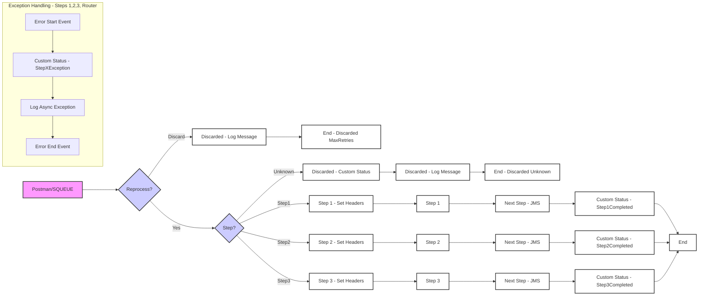

**iFlowId:** SEDA_Model_-_Single_Queue_-_Restart_and_Discard **- iFlowVersion:** 1.0.0

**Mermaid Diagram**
- **Visual representation of the flow**

**Functional Summary**
- **Brief description of the iFlow**
This iFlow implements a SEDA (Staged Event-Driven Architecture) pattern with a single JMS queue. It receives a message, processes it through multiple steps (Step 1, Step 2, Step 3), and handles exceptions by logging them. The iFlow also incorporates retry and discard mechanisms for messages that fail processing. The flow can be triggered via HTTPS, putting a message to a JMS queue (SQUEUE).

- **Involved systems**
    - SQUEUE
    - RQUEUE
    - Postman

- **Used Adapters**
    - JMS
    - HTTPS

- **Key steps**
 1. Receive a message from the SQUEUE via JMS.
 2. Determine if the message needs to be reprocessed based on retry attempts. If max retries exceeded, discard the message.
 3. Route the message based on the "Step" property in the message.
 4. Execute "Step 1," "Step 2," or "Step 3" local integration processes. These steps enrich the message in the flow.
 5. After each step log that the step is completed.
 6. Send the message to RQUEUE via JMS after steps 1, 2, and 3 for the next step.
 7. Handle exceptions in each step by logging them to processing log.
 8. If the step is "Unknown," log and discard the message.
 9. A dummy start process exists to start the process via HTTPS/JMS.

- **Message transformation**
    - Header enrichment to set `SAP_Sender`, `SAP_Receiver`, `SAP_MessageType`, and `SAP_MessageProcessingLogCustomStatus` at various stages.
    - Content enrichment to prepare messages for subsequent steps.
    - Constant assignments within Enrichers.

- **Externalized parameters list and their descriptions**
    - `SEDA_MAIN_QUEUE`: The name of the JMS queue used for message exchange between different steps.
    - `Number of Concurrent Processes`: Specifies the number of concurrent processes for the JMS sender adapter.
    - `Maximum Retry Interval`: The maximum time interval for retrying failed message processing.
    - `Retry Interval`: The time interval for retrying failed message processing.
    - `Expiration Period`: The time after which JMS messages expire.
    - `Retention Threshold 4 Alerting`: Threshold for triggering alerts based on message retention.
    - `MaxRetries`: maximum number of retries.

- **DataStore / JMS Dependency**
Yes

- **Cloud Connector Dependency**
Not Found

- **Common Scripts Dependency**
    - Log_Discarded_Message.groovy
    - Log_Exception_Async.groovy
    - script1.groovy