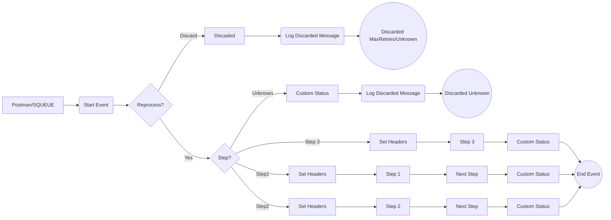

**iFlowId**: SEDA_Model_-_Single_Queue_-_Restart_and_Discard - **iFlowVersion**: 1.0.0

**Mermaid Diagram**
- **Visual representation of the flow**

**Functional Summary**
- **Brief description of the iFlow**
The iFlow implements a SEDA (Staged Event-Driven Architecture) pattern with a single JMS queue for asynchronous processing. It receives messages, processes them in multiple steps, and handles exceptions by logging them. Messages can be reprocessed or discarded based on the number of retries.

- **Involved systems**
    - SQUEUE (Sender Queue)
    - RQUEUE (Receiver Queue)
    - Postman

- **Used Adapters**
    - JMS
    - HTTPS

- **Key steps**
 1. Receives a message via HTTPS or JMS adapter.
 2. Sets headers and saves the initial message in "Dummy Start" process.
 3. Routes the message to Step 1, Step 2, or Step 3 based on the "Step" property.
 4. Each Step prepares a message and updates the "Step" property.
 5. Sends the message to the next step via JMS, or discards it if the maximum number of retries is exceeded.

- **Message transformation**
    - Enricher activities are used to create and delete message headers and properties.
    - Content modifiers are used to prepare step messages.
    - Groovy scripts are used for logging.

- **Externalized parameters list and their descriptions**
    - SEDA_MAIN_QUEUE: Name of the JMS queue used for asynchronous communication.
    - Number of Concurrent Processes: Number of concurrent processes.
    - Maximum Retry Interval: Maximum interval for retries.
    - Expiration Period: The time after which a message expires.
    - Retention Threshold 4 Alerting: Storage retention limit to trigger an alert.
    - Retry Interval: Interval at which the message will be retried.
    - MaxRetries: Maximum number of retries before discarding the message.

- **DataStore / JMS Dependency**
Yes

- **Cloud Connector Dependency**
Not Found

- **Common Scripts Dependency**
Yes