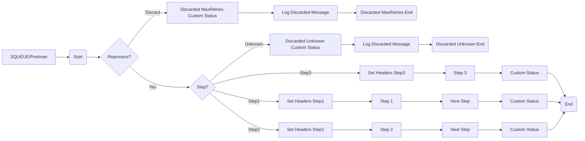

**iFlowId**: SEDA_Model_-_Single_Queue_-_Restart_and_Discard - **iFlowVersion**: 1.0.0

**Mermaid Diagram**

**Functional Summary**
- **Brief description of the iFlow**
This iFlow implements a SEDA (Staged Event-Driven Architecture) pattern using a single JMS queue for asynchronous message processing. It demonstrates how to handle message retries and discarding of messages after exceeding the maximum retry attempts, including exception handling for each step. The iFlow processes messages in three steps, each represented by a separate integration process.

- **Involved systems**
    - SQUEUE
    - RQUEUE
    - Postman

- **Used Adapters**
    - JMS
    - HTTPS

- **Key steps**
    1. Receives a message via JMS adapter from SQUEUE, or an HTTPs request from Postman.
    2. The message is passed through an Exclusive Gateway to reprocess, or discard it if it has already been processed.
    3. The SEDA Router determines which step is next.
    4. In each step, there's a subprocess for exception handling where exceptions are logged.
    5. The iFlow enriches the message with headers and properties to track the processing status.
    6. After a final step, if the message is discarded then logging is done before the process completes.

- **Message transformation**
    - Enricher is used to set Headers and Properties, including custom status.
    - Groovy scripts are used to log discarded messages and exceptions.
    - Content modifiers are used to prepare the step.

- **Externalized parameters list and their descriptions**
    - SEDA_MAIN_QUEUE: The name of the JMS queue used for message exchange between the steps.
    - Retention Threshold 4 Alerting: Threshold for alerting based on message retention.
    - Expiration Period: The time period after which messages expire.
    - Number of Concurrent Processes: The number of concurrent processes that can process messages from the JMS queue.
    - Maximum Retry Interval: The maximum interval between retry attempts.
    - Retry Interval: The interval between retry attempts.
    - MaxRetries: The maximum number of retries before discarding a message.

- **DataStore / JMS Dependency**
Yes

- **Cloud Connector Dependency**
Not Found

- **Common Scripts Dependency**
    - Log_Discarded_Message.groovy
    - Log_Exception_Async.groovy
    - script1.groovy

- **ProcessDirect ComponentType Dependency**
Not Found