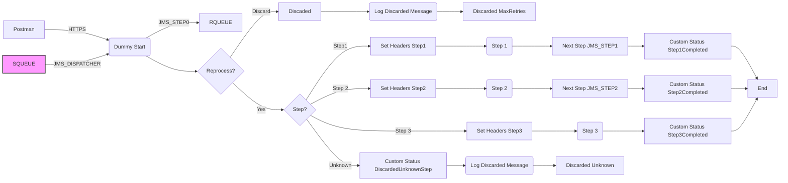

**iFlowId**: SEDA_Model_-_Single_Queue_-_Restart_and_Discard - **iFlowVersion**: 1.0.0
**Mermaid Diagram**

**Functional Summary**
- **Brief description of the iFlow**
This iFlow implements a SEDA (Staged Event-Driven Architecture) pattern using JMS queues. It receives messages, processes them in a sequence of steps (Step 1, Step 2, Step 3), and sends the messages to the respective queues for each step. It handles exceptions at each step, logging them and potentially discarding messages that exceed a retry threshold or are routed to unknown destinations.

- **Involved systems**
    - SQUEUE
    - RQUEUE
    - Postman

- **Used Adapters**
    - JMS
    - HTTPS

- **Key steps**
    1. Receive message via JMS adapter from SQUEUE.
    2. Determine the next processing step based on the 'Step' property.
    3. Based on the identified step, call the related integration process: Step 1, Step 2 or Step 3.
    4. Each step updates message content.
    5. If the 'Step' property is not recognized (unknown destination), discard the message and log it.
    6. If processing fails in any step, log the exception and discard.
    7. If max retries are exceeded, discard the message and log it.
    8. After the final step has been processed, complete the iFlow.

- **Message transformation**
    - Each "Step" process (Step 1, Step 2, Step 3) contains a "Prepare Step" Enricher that modifies the message content and sets the 'Step' property for the next step.
    - "Set Headers" Enrichers add metadata (Sender, Receiver, MessageType, Status) to the message headers at different stages of the iFlow.
    - "Custom Status" Enrichers set SAP Message Processing Log Custom Statuses.

- **Externalized parameters list and their descriptions**
    - `SEDA_MAIN_QUEUE`: Name of the JMS queue used for inter-step communication.
    - `Retention Threshold 4 Alerting`: Threshold for alerting on message retention.
    - `Expiration Period`: Message expiration time.
    - `Number of Concurrent Processes`: The number of concurrent processes.
    - `Maximum Retry Interval`: The maximum retry interval.
    - `Retry Interval`: The retry interval.
    - `MaxRetries`: Maximum retries before message is discarded.

- **DataStore / JMS Dependency**
Yes