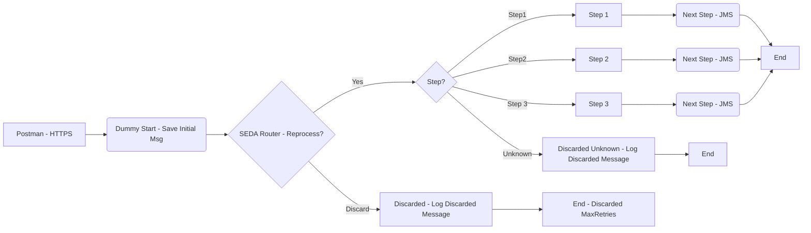

**iFlowId**: SEDA_Model_-_Single_Queue_-_Restart_and_Discard - **iFlowVersion**: 1.0.0

**Mermaid Diagram**

**Functional Summary**
- **Brief description of the iFlow**
This iFlow implements a SEDA (Staged Event-Driven Architecture) pattern using a single JMS queue. Messages are received, processed in multiple steps (Step 1, Step 2, Step 3), and then sent to the receiver. The iFlow handles exceptions at each step, logs them, and provides retry and discard mechanisms based on the number of retries. It includes logging, custom statuses, and message transformations between steps.

- **Involved systems with Adapters Type and Endpoint Type**
    - Postman - HTTPS - EndpointSender
    - SQUEUE - JMS - EndpointSender
    - RQUEUE - JMS - EndpointReceiver

- **Key steps**
 1. Receives a message via HTTPS from Postman.
 2. The message is initially saved and enriched with headers (Set Headers step).
 3. The message is sent to the JMS queue (RQUEUE) via JMS Adapter using ServiceTask_9058.
 4. The message is picked up from JMS queue (SQUEUE) via JMS Adapter.
 5. A router determines the next step based on the 'Step' property.
 6. Step 1: Prepares for Step 2.
 7. Step 2: Prepares for Step 3.
 8. Step 3: Prepares for the end message.
 9. Exceptions are handled and logged.
 10. Messages are discarded based on retry count.

- **Message transformation**
    - **Set Headers steps:** Adding `SAP_Sender`, `SAP_Receiver`, and `SAP_MessageType` headers. Adding custom statuses.
    - **Prepare Steps:** Modify property `Step` adding constant values.
    - **Prepare Step 2/3:** Set the message content in base64.

- **Externalized parameters list and their descriptions**
    - `SEDA_MAIN_QUEUE`: JMS Queue Name for inbound and outbound communication.
    - `Retention Threshold 4 Alerting`: Retention threshold for alerting.
    - `Expiration Period`: Message Expiration Period.
    - `Number of Concurrent Processes`: Number of concurrent processes for JMS.
    - `Maximum Retry Interval`: Maximum retry interval for JMS.
    - `Retry Interval`: Retry interval for JMS.
    - `MaxRetries`: Maximum retries before discarding the message.

- **DataStore / JMS Dependency**
Yes

- **Cloud Connector Dependency**
Not Found

- **Common Scripts Dependency**
- Log_Discarded_Message.groovy
- Log_Exception_Async.groovy
- script1.groovy

- **ProcessDirect ComponentType Dependency**
Not Found