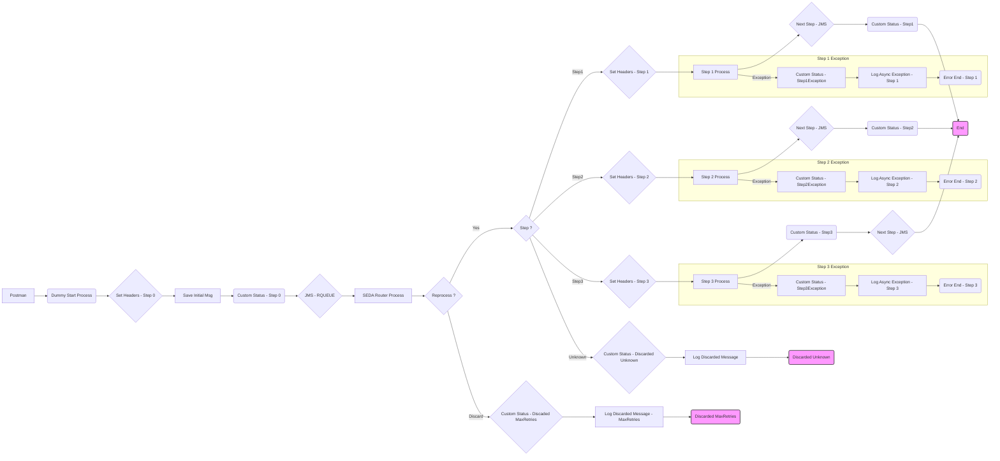

**iFlowId**: SEDA_Model_-_Single_Queue_-_Restart_and_Discard - **iFlowVersion**: 1.0.0

**Mermaid Diagram**

**Functional Summary**
- **Brief description of the iFlow**
This iFlow implements a SEDA (Staged Event-Driven Architecture) pattern with a single JMS queue. It receives messages, processes them in multiple steps (Step1, Step2, Step3), and handles potential exceptions during each step. Messages that fail after a configured number of retries are discarded. It includes logging and custom status updates for monitoring. The iFlow also handles initial message saving and header setting.

- **Involved systems**
    - SQUEUE
    - RQUEUE
    - Postman

- **Used Adapters**
    - JMS
    - HTTPS

- **Key steps**
    1.  Receive message via JMS from SQUEUE.
    2.  Determine the message processing Step.
    3.  If the maximum number of retries has been reached, discard the message.
    4.  Process the message in Step 1, Step 2 or Step 3 depending on the Step property
    5.  If the Step is unknown, discard the message.
    6.  Each step executes a local integration process and sets headers to prepare the next step.
    7. Log all Async Exceptions in every step.
    8. Log all Discarded Messages from unknown steps or MaxRetries step.
    9. Update the custom status to the message processing log at different steps.

- **Message transformation**
    - The iFlow uses Enrichers to set headers and properties at various stages.
    - Each step can add properties to the message.
    - The "Prepare Step" Enrichers construct XML envelopes with base64 encoded messages ("Step2Message", "Step3Message").
    - Groovy scripts "Log_Discarded_Message.groovy" and "Log_Exception_Async.groovy" are used to log discarded messages and exceptions.

- **Externalized parameters list and their descriptions**
    - SEDA_MAIN_QUEUE: Name of the JMS queue used for message exchange.
    - Number of Concurrent Processes: Number of concurrent processes for the JMS adapter.
    - Maximum Retry Interval: The maximum retry interval for the JMS adapter.
    - Retry Interval: The retry interval for the JMS adapter.
    - Use Dead Letter Queue: Flag indicating whether to use a dead letter queue.
    - Expiration Period: Expiration period for messages in the JMS queue.
    - Retention Threshold 4 Alerting: Retention threshold for alerting purposes.
    - MaxRetries: The maximum number of retries for the message before discarding.

- **DataStore / JMS Dependency**
Yes

- **Cloud Connector Dependency**
Not Found