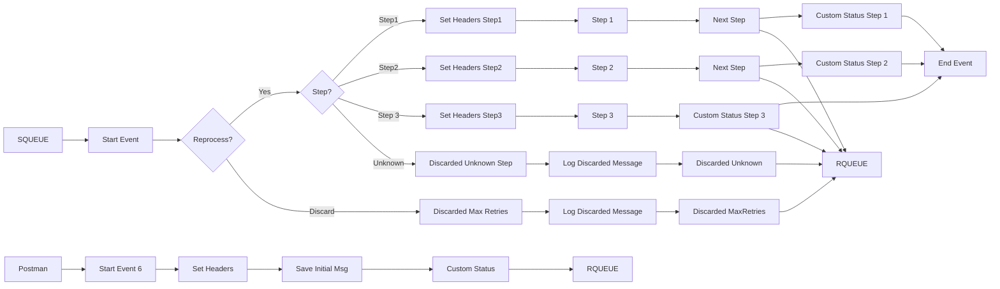

**iFlowId**: SEDA_Model_-_Single_Queue_-_Restart_and_Discard - **iFlowVersion**: 1.0.0

-   **Brief description of the iFlow**
    This iFlow implements a SEDA (Staged Event-Driven Architecture) pattern using a single JMS queue. It receives messages, processes them in sequential steps (Step 1, Step 2, Step 3), and provides exception handling for each step. It includes retry logic and discards messages that exceed the maximum retry attempts or encounter unknown steps. It logs exceptions and discarded messages for auditing.

-   **Involved systems**
    -   SQUEUE
    -   RQUEUE
    -   Postman

-   **Used Adapters**
    -   JMS
    -   HTTPS

-   **Key steps**
    1.  Receive message from SQUEUE via JMS adapter.
    2.  Determine the next processing step based on the `Step` property.
    3.  Execute Step 1, Step 2, or Step 3.
    4.  Each step prepares the message for the next step by setting headers and message content.
    5.  If a step fails, log the exception and re-try
    6.  Discard a message if it exceeds the maximum retry attempts.
    7.  Log discarded messages
    8.  Upon completion of each step, write a status to the MPL
    9.  Set message headers with receiver information and message types
    10. Messages can also be started via HTTPS to the /seda/start/jms path

-   **Message transformation**
    - The iFlow uses Enrichers to set headers and properties at various stages.
    - It also creates custom statuses for Message Processing Logs for auditing.
    - Each processing step prepares the message for the next step by setting headers and message content using Enrichers. The content of the message is modified in the Step 1, Step 2 and Step 3 processes

-   **Externalized parameters list and their descriptions**
    -   `SEDA_MAIN_QUEUE`: The name of the JMS queue used for message exchange between the steps.
    -   `Retention Threshold 4 Alerting`: The retention threshold for alerting.
    -   `Expiration Period`: The message expiration period.
    -   `Number of Concurrent Processes`: The number of concurrent processes for the JMS adapter.
    -   `Maximum Retry Interval`: The maximum retry interval for the JMS adapter.
    -   `Retry Interval`: The retry interval for the JMS adapter.
    -   `MaxRetries`: The maximum number of retries before discarding the message.

-   **DataStore / JMS Dependency**
    Yes