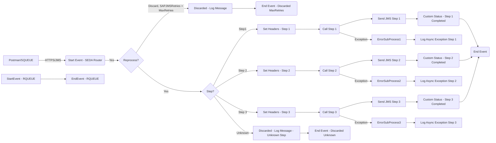

**iFlowId**: SEDA_Model_-_Single_Queue_-_Restart_and_Discard - **iFlowVersion**: 1.0.0

**Mermaid Diagram**

**Functional Summary**
- **Brief description of the iFlow**

This iFlow implements a SEDA (Staged Event-Driven Architecture) pattern using a single JMS queue. It receives messages, processes them in multiple steps (Step 1, Step 2, Step 3), and handles exceptions by logging them and potentially discarding messages after a certain number of retries or due to unknown steps. It simulates a single queue scenario with a retry mechanism and discard option.
It starts via HTTPS and JMS.

- **Involved systems**

    - SQUEUE
    - RQUEUE
    - Postman

- **Used Adapters**

    - JMS
    - HTTPS

- **Key steps**

    1. Receive message via HTTPS or JMS.
    2. The main process 'SEDA Router' determines which "Step" process should be called, based on the `Step` property.
    3. Each "Step" process prepares the message body (Step1, Step2, or Step3 messages) and sets the `Step` property for subsequent steps, using enrichers.
    4. Inside SEDA Router, after each step, message custom status is changed and if the message needs to be reprocessed goes to the next step based on current step value. 
    5. The message is finally sent to the `RQUEUE` via JMS adapter after each step.
    6. Errors at any step trigger an error sub-process where the exception is logged.
    7. Messages are discarded after exceeding the number of retries by checking the SAPJMSRetries header or in case of unknown steps in the SEDA Router.

- **Message transformation**

    -  The iFlow uses Enrichers to set Headers (Sender, Receiver, MessageType) and Properties (Step).
    - Each Step process prepares a message with name Step1Message, Step2Message, Step3Message, and sets the 'Step' property, which is the key to the SEDA Router operation.
    - Groovy scripts, `Log_Discarded_Message.groovy` and `Log_Exception_Async.groovy`, are used to log discarded messages and exceptions respectively.

- **Externalized parameters list and their descriptions**

    - SEDA_MAIN_QUEUE: JMS Queue Name.
    - Number of Concurrent Processes: Defines the number of parallel processes (JMS).
    - Maximum Retry Interval: The maximum time interval between retry attempts (JMS).
    - Expiration Period: Message expiration time (JMS).
    - Retention Threshold 4 Alerting: Threshold for retention alerting (JMS).
    - Retry Interval: Time between retry attempts (JMS).
    - MaxRetries: Maximum number of retries before discarding a message (Gateway).

- **DataStore / JMS Dependency**

Yes

- **Cloud Connector Dependency**

Not Found