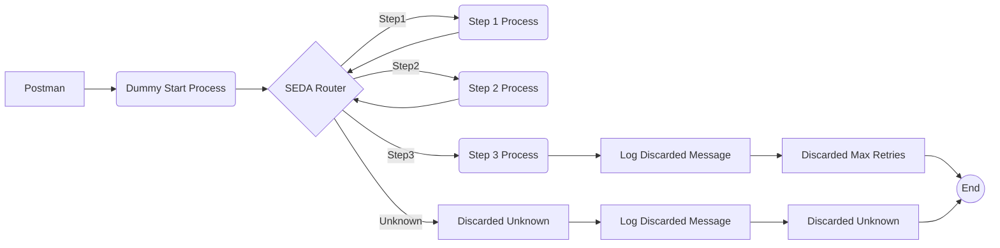

**iFlowId**: SEDA_Model_-_Single_Queue_-_Restart_and_Discard - **iFlowVersion**: 1.0.0

**Functional Summary**

- **Brief description of the iFlow**
This iFlow simulates a multi-step process using a single JMS queue and SEDA (Staged Event-Driven Architecture) pattern. It demonstrates message processing through different steps, exception handling, and message discarding based on maximum retry attempts or unknown routing. The flow is initiated by an HTTP call.

- **Involved systems**
    - Postman
    - SQUEUE
    - RQUEUE

- **Used Adapters**
    - JMS (Sender and Receiver)
    - HTTPS (Sender)

- **Key steps**
    i. An HTTP call from Postman to the iFlow triggers the process.
    ii. The "Dummy Start" process sets initial headers and saves the message to the JMS queue (`{{SEDA_MAIN_QUEUE}}`).
    iii. The "SEDA Router" process retrieves messages from the queue and routes them based on the 'Step' property.
    iv. Steps 1, 2, and 3 ("Step 1", "Step 2", and "Step 3" processes) perform specific tasks, setting headers and preparing messages for subsequent steps. If an exception occurs within those steps, logging is executed.
    v. After completing each step, the message is sent back to the JMS queue for the next step of the SEDA Router to pick up based on message content.
    vi. The iFlow can discard messages if an unknown step is encountered or if the maximum number of retries (`{{MaxRetries}}`) is exceeded and an error is logged.

- **Message transformation**
    - Each process step ("Step 1", "Step 2", "Step 3", and "Dummy Start") utilizes enrichers to set headers (`SAP_Sender`, `SAP_Receiver`, `SAP_MessageType`, `SAP_MessageProcessingLogCustomStatus`) and manipulate message content via property tables.
    - Step 2 has a wrap content that encodes a message to be base64.
    - Script tasks are present to Log Async Exception.
    - Script tasks (Groovy scripts) are present to discard message.

- **Externalized parameters list and their descriptions**
    - `{{SEDA_MAIN_QUEUE}}`: The name of the JMS queue used for asynchronous message processing.
    - `{{Number of Concurrent Processes}}`: Determines the number of concurrent processes for the JMS dispatcher.
    - `{{Maximum Retry Interval}}`: The maximum time interval for retrying failed messages.
    - `{{Retry Interval}}`: The interval between retry attempts.
    - `{{Use Dead Letter Queue}}`: Flag to decide if the dead letter queue is to be used or not.
    - `{{Retention Threshold 4 Alerting}}`: Threshold used for alerting.
    - `{{Expiration Period}}`: Period after which message expires.
    - `{{MaxRetries}}`: Maximum number of retries.

- **DataStore / JMS Dependency**
Yes

**Mermaid Diagram**

