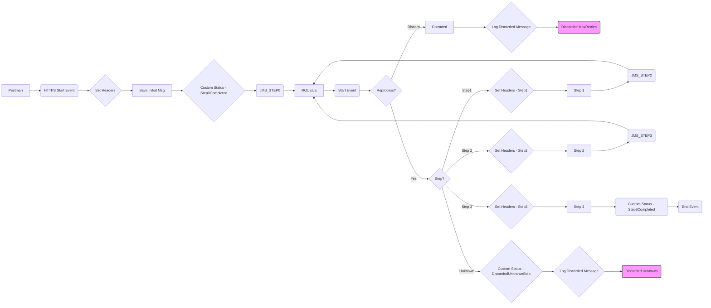

**iFlowId**: SEDA_Model_-_Single_Queue_-_Restart_and_Discard - **iFlowVersion**: 1.0.0

**Functional Summary**

- **Brief description of the iFlow**
  This iFlow demonstrates a SEDA (Staged Event-Driven Architecture) pattern with a single JMS queue. It receives messages, processes them in multiple steps, and includes error handling with retry and discard mechanisms. The flow is triggered by an HTTPS call and utilizes JMS queues for asynchronous processing between steps. It also includes logging for exceptions and discarded messages.

- **Involved systems**
  - Postman
  - SQUEUE
  - RQUEUE

- **Used Adapters**
  - HTTPS (Sender)
  - JMS (Sender and Receiver)

- **Key steps**
  i. The iFlow starts upon receiving an HTTPS request from Postman.
  ii. The incoming message from HTTPS endpoint is pushed to a JMS queue called SEDA_MAIN_QUEUE.
  iii. The message is consumed by the "SEDA Router" process.
  iv. The "SEDA Router" determines the next step based on the `Step` property in the message.
  v. The iFlow then calls individual processes (Step 1, Step 2, Step 3) based on the "Step" property value to orchestrate message processing.
  vi. Each step process can throw exceptions, which are caught by error subprocesses. These exceptions are logged, and custom status messages are set.
  vii. If a message fails processing after a configured number of retries ("MaxRetries"), it's discarded and logged.
  viii. If the Step property does not match Step1, Step2 or Step3, the message is discarded as "Unknown"

- **Message transformation**
  - The iFlow utilizes enrichers to set headers (SAP_Sender, SAP_Receiver, SAP_MessageType) and custom status (SAP_MessageProcessingLogCustomStatus) at various steps.
  - "Prepare Step" activities set a property called `Step` for routing and processing in subsequent steps.
  - Groovy scripts are used to log exceptions and discarded messages.
  - Prepare Step 2, Prepare Step 3 enrichers are used to set the Step property in the message and populate the MessageB64 payload.

- **Externalized parameters list and their descriptions**
  - `SEDA_MAIN_QUEUE`: The name of the JMS queue used for asynchronous communication between components.
  - `Number of Concurrent Processes`: The number of concurrent processes for the JMS Sender adapter.
  - `Maximum Retry Interval`: Maximum retry interval for JMS Sender adapter.
  - `Retry Interval`: Retry interval for JMS Sender adapter.
  - `Use Dead Letter Queue`: Specifies whether to use a Dead Letter Queue for JMS Sender adapter.
  - `Retention Threshold 4 Alerting`:  Retention threshold for alerting related to JMS.
  - `Expiration Period`: Expiration period for JMS messages.
  - `MaxRetries`: Maximum number of retries for processing a message before discarding it.

- **DataStore / JMS Dependency**
  Yes

**Mermaid Diagram**

