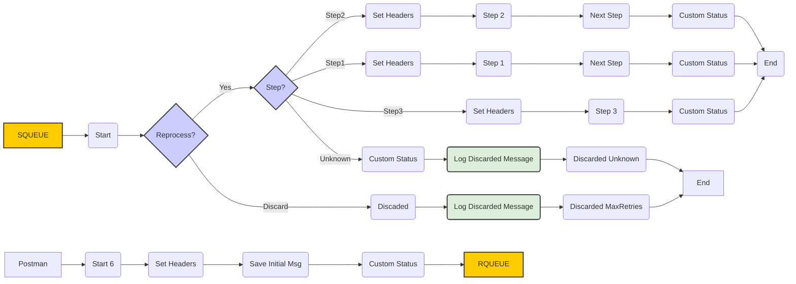

**iFlowId**: SEDA_Model_-_Single_Queue_-_Restart_and_Discard - **iFlowVersion**: 1.0.0

**Mermaid Diagram**

**Functional Summary**
- **Brief description of the iFlow**
This iFlow implements a SEDA (Staged Event-Driven Architecture) pattern with a single JMS queue. It processes messages in a sequence of steps, handling exceptions and discarding messages that exceed the maximum retry attempts or encounter unknown steps. Messages are received via JMS or HTTPS, processed through multiple integration processes (Step 1, Step 2, Step 3), and routed based on a "Step" property. It also features comprehensive exception handling and logging.

- **Involved systems**
    - SQUEUE
    - RQUEUE
    - Postman

- **Used Adapters**
    - JMS
    - HTTPS

- **Key steps**
    1.  Receive message via JMS or HTTPS.
    2.  Set initial headers (SAP_Sender, SAP_Receiver, SAP_MessageType, Step).
    3.  Route the message based on the "Step" property (Step1, Step2, Step3, or Unknown).
    4.  Execute corresponding integration processes (Step 1, Step 2, or Step 3).
    5.  Set custom statuses to the message processing log.
    6.  Send the message to the next step via JMS.
    7.  Handle exceptions and log them.
    8.  Discard messages exceeding maximum retries or having an unknown step.

- **Message transformation**
    -  The iFlow uses Enrichers to set and delete message headers and properties, including `SAP_Sender`, `SAP_Receiver`, `SAP_MessageType`, and `Step`. It also uses Groovy scripts to log discarded messages and exceptions.

- **Externalized parameters list and their descriptions**
    - `SEDA_MAIN_QUEUE`: Name of the main JMS queue used for message exchange between steps.
    - `Retention Threshold 4 Alerting`: Threshold for alerting based on message retention.
    - `Expiration Period`: Period after which messages expire.
    - `Number of Concurrent Processes`: Number of concurrent processes for JMS adapter.
    - `Maximum Retry Interval`: Maximum retry interval for the JMS adapter.
    - `Retry Interval`: Retry interval for JMS adapter.
    - `MaxRetries`: The max number of retries before discarding a message.

- **DataStore / JMS Dependency**
Yes