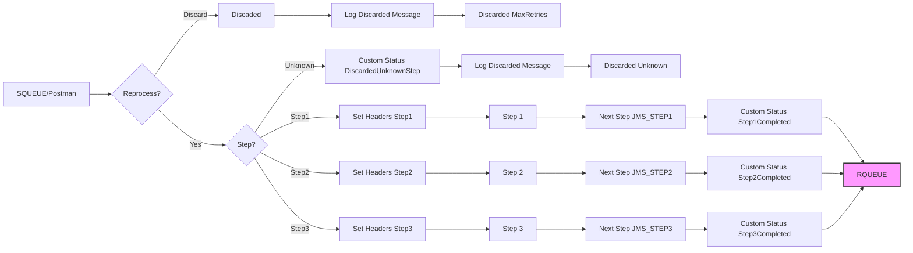

**iFlowId**: SEDA_Model_-_Single_Queue_-_Restart_and_Discard **- iFlowVersion**: 1.0.0

**Mermaid Diagram**

**Functional Summary**
- **Brief description of the iFlow**
This iFlow implements a SEDA (Staged Event-Driven Architecture) pattern using JMS queues. It receives messages, processes them through a series of steps (Step 1, Step 2, Step 3), and sends the messages to a receiver queue. The iFlow includes retry mechanisms with discard functionality based on maximum retries exceeded and exception handling with asynchronous logging. An HTTP endpoint to start the iFlow is also available.

- **Involved systems**
    - SQUEUE
    - Postman
    - RQUEUE

- **Used Adapters**
    - JMS
    - HTTPS

- **Key steps**
    1. Receive message from SQUEUE via JMS. Alternatively, receive the message from Postman via HTTP.
    2. Set initial headers and save initial message
    3. Route message through a series of steps (Step 1, Step 2, Step 3). Each step prepares the message and enriches it.
    4. Each step may throw exceptions, which are handled by logging the exception asynchronously.
    5. After each step, custom statuses are created to log the step completion.
    6. Depending on the message header `SAPJMSRetries` and a configured `MaxRetries`, the message is either reprocessed or discarded after reaching `MaxRetries` threshold. Discarded messages are logged.
    7. If the step is unknown, the message is also discarded and logged.
    8. After all steps, the message is routed to the receiving queue (RQUEUE) via JMS.

- **Message transformation**
    - Header enrichment with Sender, Receiver, and MessageType.
    - Message content enrichment with constant values in each step (e.g., "Step2Message").
    - MessageProcessingLogCustomStatus creation for different stages (e.g., "Step1Completed", "RouterException").

- **Externalized parameters list and their descriptions**
    - `SEDA_MAIN_QUEUE`: Queue used for JMS communication between the steps and the receiver.
    - `Number of Concurrent Processes`: Number of concurrent processes used by the JMS adapter.
    - `Maximum Retry Interval`: Maximum interval for retries, used by JMS adapter.
    - `Retry Interval`: Interval between retry attempts, used by JMS adapter.
    - `MaxRetries`: Maximum number of retries before discarding the message.
    - `Retention Threshold 4 Alerting`: Threshold before triggering alerting in JMS.
    - `Expiration Period`: Time until messages expire in JMS.

- **DataStore / JMS Dependency**
Yes

- **Cloud Connector Dependency**
Not Found

- **Common Scripts Dependency**
Groovy_Logging_Scripts

- **Cloud Integration Process Direct ComponentType Dependency**
Not Found