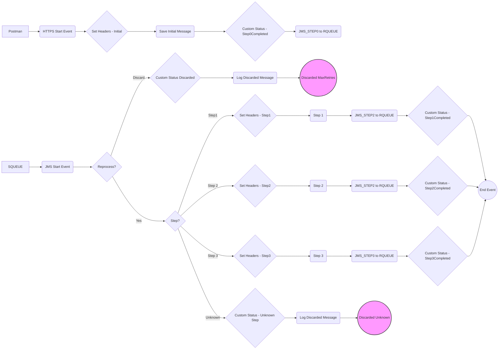

**iFlowId**: SEDA_Model_-_Single_Queue_-_Restart_and_Discard - **iFlowVersion**: 1.0.0

**Functional Summary**

-   **Brief description of the iFlow**

    This iFlow implements a SEDA (Staged Event-Driven Architecture) pattern with a single JMS queue. It receives messages, processes them in multiple steps, and handles exceptions. The iFlow also incorporates retry mechanisms and discards messages that exceed the maximum retry attempts or are routed to an unknown step.

-   **Involved systems**

    *   SQUEUE
    *   RQUEUE
    *   Postman

-   **Used Adapters**

    *   JMS
    *   HTTPS

-   **Key steps**

    1.  Receive message via JMS adapter from SQUEUE.
    2.  Determine the current step of the message processing.
    3.  Execute steps 1, 2, or 3 based on a property.
    4.  If the step is unknown, discard the message.
    5.  If the maximum number of retries is reached, discard the message.
    6.  Log discarded messages.

-   **Message transformation**

    *   Header enrichment to set sender, receiver, and message type.
    *   Property enrichment to set the processing step.
    *   Custom status updates via enricher.
    *   Payload enrichment using Groovy scripts for logging discarded messages and exceptions.
    *   Prepare step 2 and step 3 enrichers to set the step name and wrap the content.

-   **Externalized parameters list and their descriptions**

    *   `SEDA_MAIN_QUEUE`: Name of the JMS queue used for message exchange between the steps.
    *   `Number of Concurrent Processes`: Number of concurrent processes for JMS adapter.
    *   `Maximum Retry Interval`: Maximum retry interval for JMS adapter.
    *   `Retry Interval`: Retry interval for JMS adapter.
    *   `Use Dead Letter Queue`: Flag to enable or disable the use of a dead letter queue for JMS adapter.
    *   `ExponentialBackoff`: Flag to enable exponential backoff for JMS adapter retry mechanism.
    *   `Retention Threshold 4 Alerting`: The retention threshold for queue depth alerting.
    *   `Expiration Period`: The expiration period for messages.
    *   `MaxRetries`:  The number of retries until the message is discarded.

-   **DataStore / JMS Dependency**

    Yes

**Mermaid Diagram**

