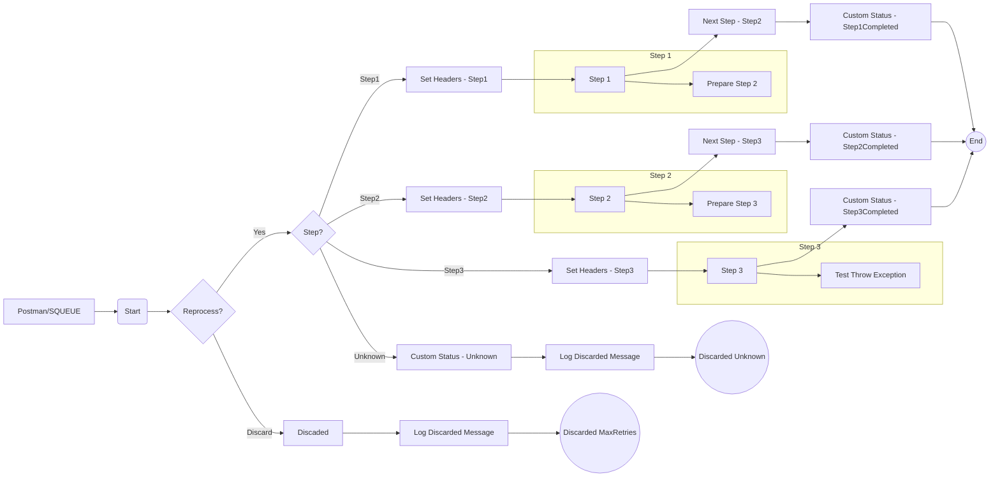

**iFlowId**: SEDA_Model_-_Single_Queue_-_Restart_and_Discard - **iFlowVersion**: 1.0.0

**Functional Summary**

- **Brief description of the iFlow**
This iFlow implements a SEDA (Staged Event-Driven Architecture) pattern using JMS queues. It receives a message, processes it through a series of steps (Step 1, Step 2, Step 3), and then sends the final result. The iFlow includes error handling, message logging, and a mechanism to discard messages that exceed a retry limit or that target an unknown step. The flow can be triggered by HTTPS and JMS. 

- **Involved systems**
    - SQUEUE
    - RQUEUE
    - Postman
    
- **Used Adapters**
    - JMS
    - HTTPS

- **Key steps**
    1.  Receive message from SQUEUE via JMS or Postman via HTTPS.
    2.  Determine the current "Step" based on a property.
    3.  Based on the "Step", route the message to the appropriate process:
        -   Step 1: Calls Process_36 ("Step 1").
        -   Step 2: Calls Process_40 ("Step 2").
        -   Step 3: Calls Process_44 ("Step 3").
        -   Unknown: Discards the message.
    4.  Each step sets headers, performs some processing, and updates message processing log status.
    5.  If a step encounters an error, it logs the exception.
    6.  Discard messages exceeding retry limits, logging these as well.

- **Message transformation**
    - The iFlow leverages Enricher components to set headers (e.g., SAP_Sender, SAP_Receiver, SAP_MessageType) and custom message processing log statuses.
    - Each "Step" process (Step 1, 2, 3) prepares data for the next step by modifying the message content using enrichers, for instance, encoding a 'Step2Message' string into base64 format.
    - Groovy scripts are utilized to log discarded messages or exceptions.

- **Externalized parameters list and their descriptions**
    - `{{SEDA_MAIN_QUEUE}}`: JMS Queue name used for inbound and outbound messaging.
    - `{{Retention Threshold 4 Alerting}}`: Threshold for alerting when message retention exceeds a limit.
    - `{{Expiration Period}}`: Message expiration period.
    - `{{Number of Concurrent Processes}}`: Number of concurrent processes for the JMS adapter.
    - `{{Maximum Retry Interval}}`: Maximum retry interval for the JMS adapter.
    - `{{Retry Interval}}`: Retry interval for the JMS adapter.
    - `{{MaxRetries}}`: Maximum number of retries before discarding a message.

- **DataStore / JMS Dependency**
Yes

**Mermaid Diagram**

