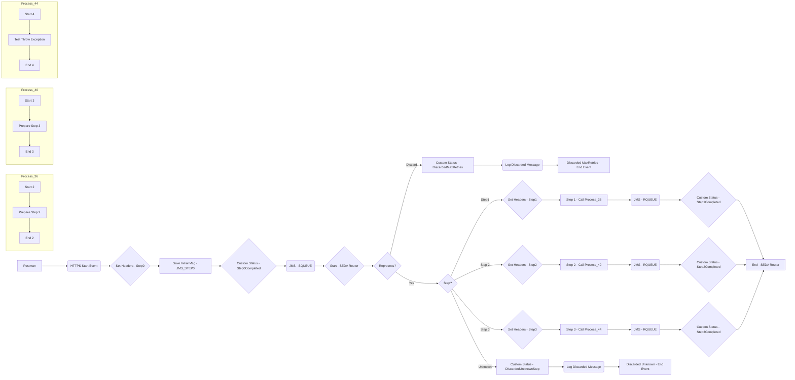

**iFlowId**: SEDA_Model_-_Single_Queue_-_Restart_and_Discard - **iFlowVersion**: 1.0.0

**Functional Summary**

- **Brief description of the iFlow**
This iFlow implements a SEDA (Staged Event-Driven Architecture) pattern using a single JMS queue for asynchronous processing. It receives messages, routes them through different processing steps (simulated by direct calls to local integration processes), and handles potential exceptions by logging them and discarding messages that exceed the maximum retry count or have an unknown step.

- **Involved systems**
    - SQUEUE (Sender Queue)
    - RQUEUE (Receiver Queue)
    - Postman (HTTP Client for triggering the flow)

- **Used Adapters**
    - JMS (Java Message Service)
    - HTTPS

- **Key steps**
    i.  Receive message from SQUEUE via JMS adapter.
    ii. Route message based on the `Step` property (Step1, Step2, Step3 or Unknown).
    iii. Each step (Step1, Step2, Step3) calls a dedicated local integration process that prepares and sends the message to the next step.
    iv. If a step fails, an exception subprocess logs the error.
    v. If the message has been retried more than the maximum allowed times (`MaxRetries`), or if the step is unknown, the message is discarded, and an appropriate log is written.
    vi. The final message is sent to RQUEUE via JMS adapter.
    vii. Postman sends message via HTTPs adapter that triggers the flow.

- **Message transformation**
    - The iFlow enriches the message with headers (like `SAP_Sender`, `SAP_Receiver`, `SAP_MessageType`) and custom statuses for logging purposes.
    - Content modifiers ("Enrichers") are used to create message bodies with static content.

- **Externalized parameters list and their descriptions**
    - `SEDA_MAIN_QUEUE`: The name of the JMS queue used for message exchange between components.
    - `Retention Threshold 4 Alerting`: Threshold for message retention alerting (JMS adapter setting)
    - `Expiration Period`: Message expiration period (JMS adapter setting)
    - `Number of Concurrent Processes`: Number of concurrent processes for the JMS receiver adapter.
    - `Maximum Retry Interval`: Maximum retry interval for the JMS receiver adapter.
    - `Retry Interval`: Retry interval for the JMS receiver adapter.
    - `MaxRetries`: Maximum number of retries before discarding a message.

- **DataStore / JMS Dependency**
Yes

**Mermaid Diagram**

